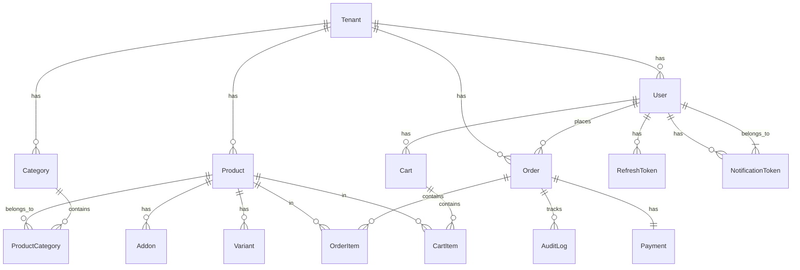

# Modelo de Datos

**Versión**: 1.1
**Última actualización**: 2025-11-07 19:02
**Estado**: En Progreso

---

## Diagrama ER



---

## Esquema Prisma Completo

```prisma
// prisma/schema.prisma
generator client {
  provider = "prisma-client-js"
}

datasource db {
  provider = "postgresql"
  url      = env("DATABASE_URL")
}

// ============================================
// Multi-Tenancy
// ============================================

model Tenant {
  id        String   @id @default(uuid())
  name      String
  slug      String   @unique
  domain    String?  @unique
  config    Json?
  active    Boolean  @default(true)
  createdAt DateTime @default(now()) @map("created_at")
  updatedAt DateTime @updatedAt @map("updated_at")

  // Relations
  users                User[]
  products             Product[]
  categories           Category[]
  orders               Order[]
  notifications        Notification[]
  analyticsRollups     AnalyticsRollup[]
  auditLogs            AuditLog[]

  @@map("tenants")
}

// ============================================
// Users & Auth
// ============================================

enum Role {
  OWNER
  MANAGER
  CASHIER
  KITCHEN
  DELIVERY
  CUSTOMER
}

model User {
  id           String   @id @default(uuid())
  tenantId     String   @map("tenant_id")
  email        String
  passwordHash String   @map("password_hash")
  firstName    String?  @map("first_name")
  lastName     String?  @map("last_name")
  phone        String?
  roles        Role[]
  active       Boolean  @default(true)
  createdAt    DateTime @default(now()) @map("created_at")
  updatedAt    DateTime @updatedAt @map("updated_at")

  // Relations
  tenant            Tenant             @relation(fields: [tenantId], references: [id], onDelete: Cascade)
  refreshTokens     RefreshToken[]
  orders            Order[]
  carts             Cart[]
  notificationTokens NotificationToken[]
  auditLogs         AuditLog[]

  @@unique([tenantId, email])
  @@index([tenantId, email])
  @@map("users")
}

model RefreshToken {
  id        String    @id @default(uuid())
  userId    String    @map("user_id")
  token     String    @unique
  expiresAt DateTime  @map("expires_at")
  createdAt DateTime  @default(now()) @map("created_at")
  revokedAt DateTime? @map("revoked_at")

  // Relations
  user User @relation(fields: [userId], references: [id], onDelete: Cascade)

  @@index([userId])
  @@index([token])
  @@map("refresh_tokens")
}

// ============================================
// Catalog
// ============================================

model Category {
  id          String   @id @default(uuid())
  tenantId    String   @map("tenant_id")
  name        String
  description String?
  image       String?
  sortOrder   Int      @default(0) @map("sort_order")
  active      Boolean  @default(true)
  createdAt   DateTime @default(now()) @map("created_at")
  updatedAt   DateTime @updatedAt @map("updated_at")

  // Relations
  tenant   Tenant            @relation(fields: [tenantId], references: [id], onDelete: Cascade)
  products ProductCategory[]

  @@unique([tenantId, name])
  @@index([tenantId, active])
  @@map("categories")
}

model Product {
  id          String    @id @default(uuid())
  tenantId    String    @map("tenant_id")
  name        String
  description String?
  sku         String
  price       Decimal   @db.Decimal(10, 2)
  taxRate     Decimal   @default(0) @map("tax_rate") @db.Decimal(5, 4)
  stock       Int       @default(0)
  images      String[]  @default([])
  active      Boolean   @default(true)
  deletedAt   DateTime? @map("deleted_at")
  createdAt   DateTime  @default(now()) @map("created_at")
  updatedAt   DateTime  @updatedAt @map("updated_at")

  // Relations
  tenant      Tenant            @relation(fields: [tenantId], references: [id], onDelete: Cascade)
  categories  ProductCategory[]
  variants    Variant[]
  addons      Addon[]
  cartItems   CartItem[]
  orderItems  OrderItem[]

  @@unique([tenantId, sku])
  @@index([tenantId, active])
  @@index([tenantId, name])
  @@map("products")
}

model ProductCategory {
  productId  String @map("product_id")
  categoryId String @map("category_id")

  product  Product  @relation(fields: [productId], references: [id], onDelete: Cascade)
  category Category @relation(fields: [categoryId], references: [id], onDelete: Cascade)

  @@id([productId, categoryId])
  @@map("product_categories")
}

model Variant {
  id         String  @id @default(uuid())
  productId  String  @map("product_id")
  name       String
  priceDelta Decimal @default(0) @map("price_delta") @db.Decimal(10, 2)
  sortOrder  Int     @default(0) @map("sort_order")

  product Product @relation(fields: [productId], references: [id], onDelete: Cascade)

  @@index([productId])
  @@map("variants")
}

model Addon {
  id        String  @id @default(uuid())
  productId String  @map("product_id")
  name      String
  price     Decimal @db.Decimal(10, 2)
  sortOrder Int     @default(0) @map("sort_order")

  product Product @relation(fields: [productId], references: [id], onDelete: Cascade)

  @@index([productId])
  @@map("addons")
}

// ============================================
// Cart
// ============================================

model Cart {
  id        String    @id @default(uuid())
  tenantId  String    @map("tenant_id")
  userId    String?   @map("user_id")
  sessionId String?   @map("session_id")
  expiresAt DateTime? @map("expires_at")
  createdAt DateTime  @default(now()) @map("created_at")
  updatedAt DateTime  @updatedAt @map("updated_at")

  tenant Tenant?    @relation(fields: [tenantId], references: [id], onDelete: Cascade)
  user   User?      @relation(fields: [userId], references: [id], onDelete: Cascade)
  items  CartItem[]

  @@index([tenantId, userId])
  @@index([sessionId])
  @@map("carts")
}

model CartItem {
  id        String   @id @default(uuid())
  cartId    String   @map("cart_id")
  productId String   @map("product_id")
  variantId String?  @map("variant_id")
  addons    String[] @default([])
  quantity  Int      @default(1)
  unitPrice Decimal  @map("unit_price") @db.Decimal(10, 2)

  cart    Cart    @relation(fields: [cartId], references: [id], onDelete: Cascade)
  product Product @relation(fields: [productId], references: [id], onDelete: Restrict)

  @@index([cartId])
  @@map("cart_items")
}

// ============================================
// Orders
// ============================================

enum OrderStatus {
  PENDING
  CONFIRMED
  PREPARING
  IN_TRANSIT
  DELIVERED
  CANCELLED
}

enum DeliveryMethod {
  DELIVERY
  PICKUP
  DINE_IN
}

model Order {
  id             String         @id @default(uuid())
  tenantId       String         @map("tenant_id")
  userId         String         @map("user_id")
  orderNumber    String         @map("order_number")
  status         OrderStatus    @default(PENDING)
  deliveryMethod DeliveryMethod @map("delivery_method")

  // Pricing
  subtotal       Decimal        @db.Decimal(10, 2)
  taxes          Decimal        @default(0) @db.Decimal(10, 2)
  discount       Decimal        @default(0) @db.Decimal(10, 2)
  tip            Decimal        @default(0) @db.Decimal(10, 2)
  deliveryFee    Decimal        @default(0) @map("delivery_fee") @db.Decimal(10, 2)
  total          Decimal        @db.Decimal(10, 2)

  // Delivery info
  address        Json?
  deliveryNotes  String?        @map("delivery_notes")

  // Metadata
  couponCode     String?        @map("coupon_code")
  createdAt      DateTime       @default(now()) @map("created_at")
  updatedAt      DateTime       @updatedAt @map("updated_at")
  confirmedAt    DateTime?      @map("confirmed_at")
  deliveredAt    DateTime?      @map("delivered_at")

  // Relations
  tenant     Tenant      @relation(fields: [tenantId], references: [id], onDelete: Cascade)
  user       User        @relation(fields: [userId], references: [id], onDelete: Restrict)
  items      OrderItem[]
  payment    Payment?
  auditLogs  AuditLog[]

  @@unique([tenantId, orderNumber])
  @@index([tenantId, status])
  @@index([tenantId, userId])
  @@index([tenantId, createdAt])
  @@map("orders")
}

model OrderItem {
  id        String   @id @default(uuid())
  orderId   String   @map("order_id")
  productId String   @map("product_id")
  variantId String?  @map("variant_id")
  addons    String[] @default([])
  quantity  Int
  unitPrice Decimal  @map("unit_price") @db.Decimal(10, 2)
  subtotal  Decimal  @db.Decimal(10, 2)

  order   Order   @relation(fields: [orderId], references: [id], onDelete: Cascade)
  product Product @relation(fields: [productId], references: [id], onDelete: Restrict)

  @@index([orderId])
  @@map("order_items")
}

// ============================================
// Payments
// ============================================

enum PaymentProvider {
  MERCADOPAGO
  STRIPE
  MANUAL
}

enum PaymentStatus {
  PENDING
  APPROVED
  REJECTED
  CANCELLED
  REFUNDED
}

model Payment {
  id         String          @id @default(uuid())
  orderId    String          @unique @map("order_id")
  provider   PaymentProvider
  externalId String?         @map("external_id")
  amount     Decimal         @db.Decimal(10, 2)
  status     PaymentStatus   @default(PENDING)
  metadata   Json?
  createdAt  DateTime        @default(now()) @map("created_at")
  updatedAt  DateTime        @updatedAt @map("updated_at")
  paidAt     DateTime?       @map("paid_at")

  order Order @relation(fields: [orderId], references: [id], onDelete: Cascade)

  @@index([externalId])
  @@index([status])
  @@map("payments")
}

// ============================================
// Notifications
// ============================================

enum NotificationChannel {
  FCM
  WEBSOCKET
  EMAIL
}

model Notification {
  id          String                @id @default(uuid())
  tenantId    String                @map("tenant_id")
  userId      String                @map("user_id")
  type        String
  channels    NotificationChannel[]
  title       String
  body        String
  data        Json?
  delivered   Boolean               @default(false)
  read        Boolean               @default(false)
  createdAt   DateTime              @default(now()) @map("created_at")
  deliveredAt DateTime?             @map("delivered_at")
  readAt      DateTime?             @map("read_at")

  tenant Tenant @relation(fields: [tenantId], references: [id], onDelete: Cascade)

  @@index([tenantId, userId, delivered])
  @@map("notifications")
}

model NotificationToken {
  id        String   @id @default(uuid())
  userId    String   @map("user_id")
  token     String   @unique
  device    String?
  createdAt DateTime @default(now()) @map("created_at")
  updatedAt DateTime @updatedAt @map("updated_at")

  user User @relation(fields: [userId], references: [id], onDelete: Cascade)

  @@index([userId])
  @@map("notification_tokens")
}

// ============================================
// Analytics
// ============================================

model AnalyticsRollup {
  id          String   @id @default(uuid())
  tenantId    String   @map("tenant_id")
  date        DateTime @db.Date
  metric      String
  value       Decimal  @db.Decimal(15, 2)
  metadata    Json?
  createdAt   DateTime @default(now()) @map("created_at")

  tenant Tenant @relation(fields: [tenantId], references: [id], onDelete: Cascade)

  @@unique([tenantId, date, metric])
  @@index([tenantId, date])
  @@map("analytics_rollups")
}

// ============================================
// Audit Log
// ============================================

model AuditLog {
  id        String   @id @default(uuid())
  tenantId  String   @map("tenant_id")
  actorId   String?  @map("actor_id")
  action    String
  entity    String
  entityId  String   @map("entity_id")
  before    Json?
  after     Json?
  metadata  Json?
  createdAt DateTime @default(now()) @map("created_at")

  tenant Tenant @relation(fields: [tenantId], references: [id], onDelete: Cascade)
  actor  User?  @relation(fields: [actorId], references: [id], onDelete: SetNull)
  order  Order? @relation(fields: [entityId], references: [id], onDelete: Cascade)

  @@index([tenantId, entity, entityId])
  @@index([tenantId, createdAt])
  @@map("audit_logs")
}
```

---

## Índices Clave

### Performance
- `(tenant_id, created_at)`: Queries por tenant ordenadas por fecha
- `(tenant_id, active)`: Filtros de entidades activas
- `(tenant_id, email)`: Login rápido
- `(tenant_id, sku)`: Búsqueda de productos

### Búsqueda Full-Text
```sql
CREATE INDEX idx_products_name_fulltext ON products USING gin(to_tsvector('spanish', name));
CREATE INDEX idx_products_description_fulltext ON products USING gin(to_tsvector('spanish', description));
```

---

## Notas de Evolución

### Multi-Sucursal (Futuro)
Agregar `branch_id` a tablas relevantes:
- Products (inventario por sucursal)
- Orders (sucursal de origen)
- Users (sucursal asignada)

### Row Level Security
```sql
ALTER TABLE orders ENABLE ROW LEVEL SECURITY;

CREATE POLICY tenant_isolation ON orders
  USING (tenant_id = current_setting('app.current_tenant')::uuid);
```

---

## Changelog

### v1.1 - 2025-11-07 19:02
- Diagrama ER completo en Mermaid
- Esquema Prisma completo con todos los modelos
- Índices documentados
- Notas de evolución

### v1.0 - 2025-11-07
- Versión inicial
