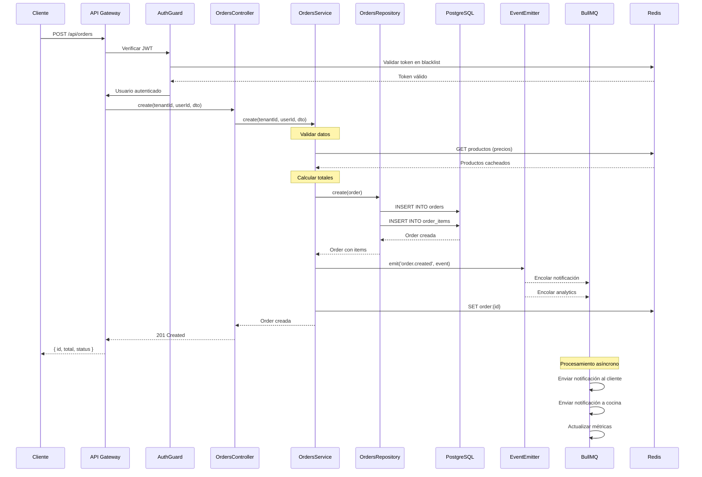
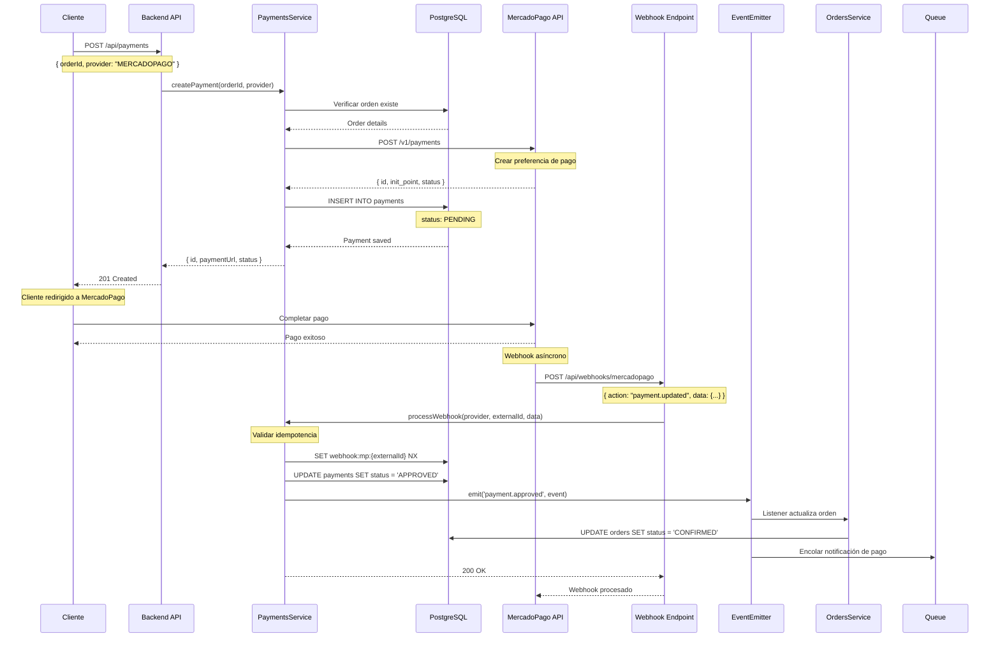
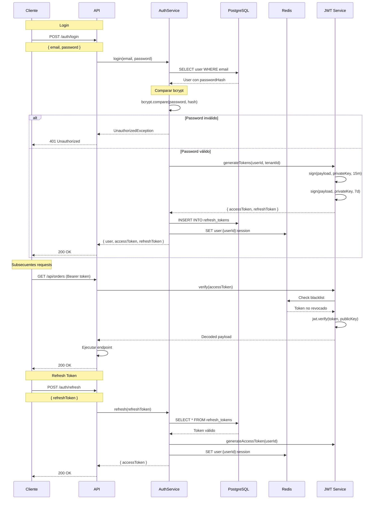
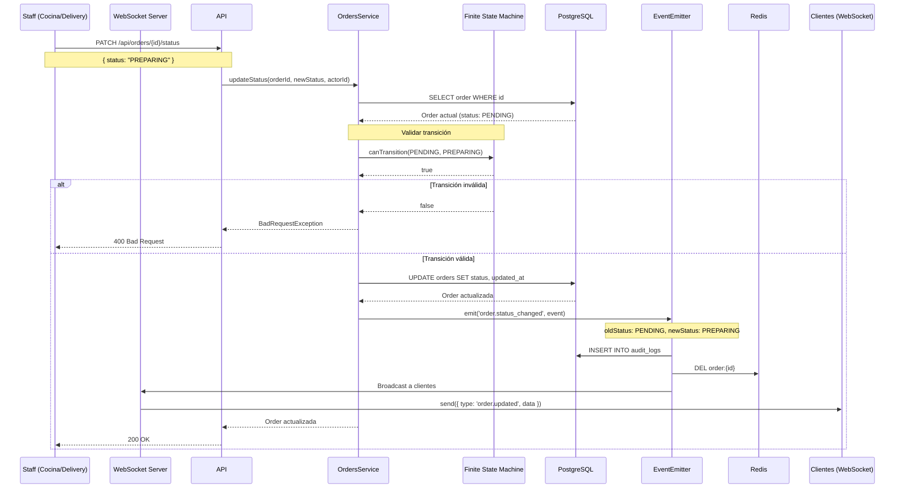
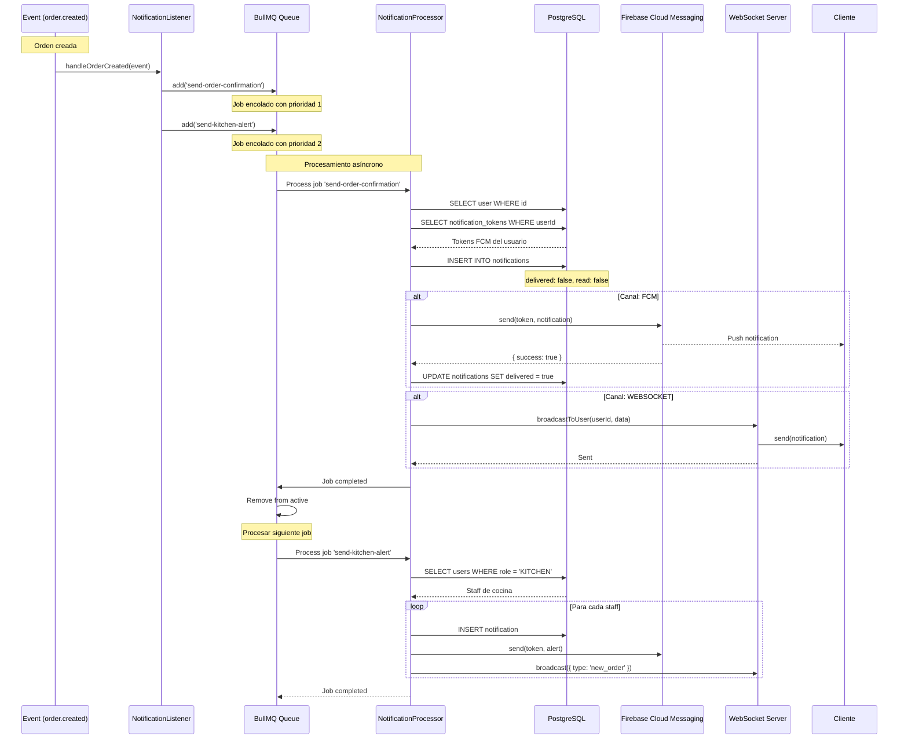
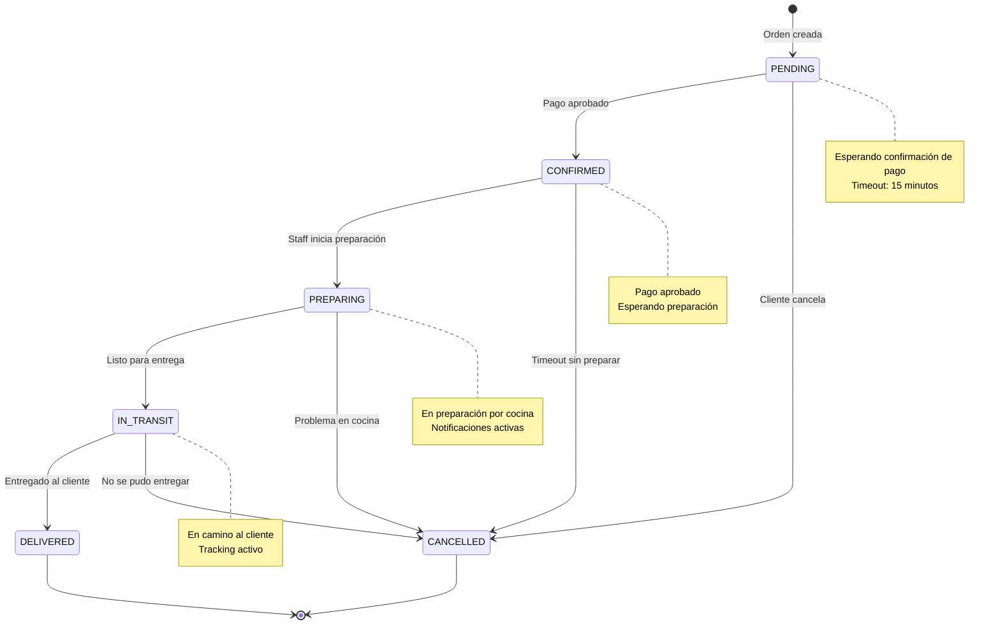
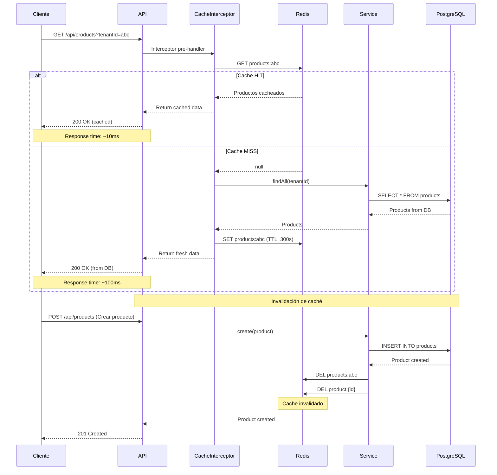

# Diagramas de Secuencia

**Versión**: 1.0
**Última actualización**: 2025-11-07 19:45
**Estado**: Completo

---

## Índice

1. [Flujo de Creación de Orden](#flujo-de-creación-de-orden)
2. [Flujo de Pago con MercadoPago](#flujo-de-pago-con-mercadopago)
3. [Flujo de Autenticación JWT](#flujo-de-autenticación-jwt)
4. [Flujo de Actualización de Estado de Orden](#flujo-de-actualización-de-estado-de-orden)
5. [Flujo de Notificaciones](#flujo-de-notificaciones)

---

## Flujo de Creación de Orden

---

## Flujo de Pago con MercadoPago

---

## Flujo de Autenticación JWT

---

## Flujo de Actualización de Estado de Orden

---

## Flujo de Notificaciones

---

## Máquina de Estados de Orden

---

## Flujo de Cache con Redis

---

## Notas de Implementación

### Timeouts y Retry

- **HTTP Requests**: Timeout 30s
- **DB Queries**: Timeout 10s
- **Redis Operations**: Timeout 5s
- **BullMQ Jobs**: 3 reintentos con backoff exponencial
- **Webhooks**: 5 reintentos, backoff: 2s, 4s, 8s, 16s, 32s

### Idempotencia

- Webhooks: Redis SETNX con TTL 1 hora
- Pagos: Columna `externalId` única
- Órdenes: `orderNumber` único por tenant

### Seguridad

- JWT: RS256 con rotación de keys cada 90 días
- Rate limiting: 100 req/min por IP
- CORS: Whitelist de dominios
- SQL Injection: Prisma con prepared statements

---

## Changelog

### v1.0 - 2025-11-07 19:45
- Diagramas de secuencia completos para flujos críticos
- Máquina de estados de órdenes
- Diagramas de cache y notificaciones
- Notas de implementación
