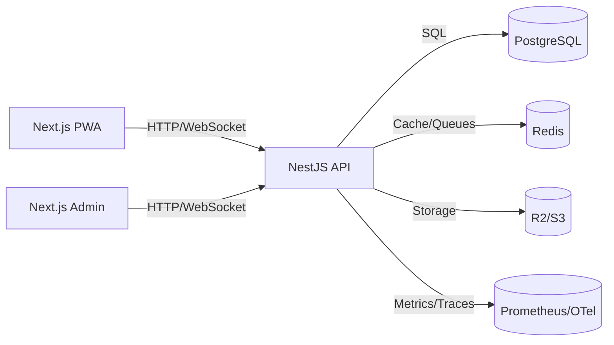

# Arquitectura General

Generado: 2025-11-07
Versión: 1.0

Este documento resume la arquitectura del Sistema Integral de Pedidos Multirubro según el PRD v1.1.

## Diagrama de Alto Nivel

## Principios
- Modularidad por dominios (auth, catálogo, pedidos, pagos, notificaciones, analítica).
- Multi-tenant lógico con aislamiento estricto.
- Observabilidad de primera clase (logs, métricas, trazas).
- Seguridad por defecto (JWT RS256, RBAC, HMAC, rate limit).
- Preparado para extracción a microservicios.

## Límites de Contexto
- Catálogo: productos, categorías, variantes.
- Pedidos: carrito, checkout, órdenes, estados.
- Pagos: providers, conciliación, webhooks.
- Notificaciones: plantillas, canales, entrega.
- Analítica: agregaciones, reportes.
