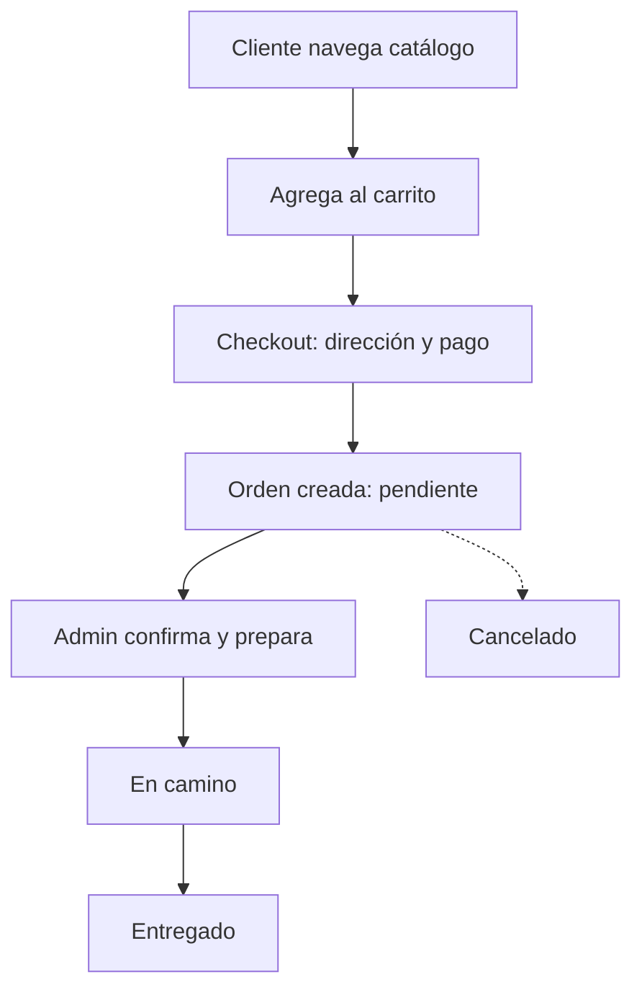
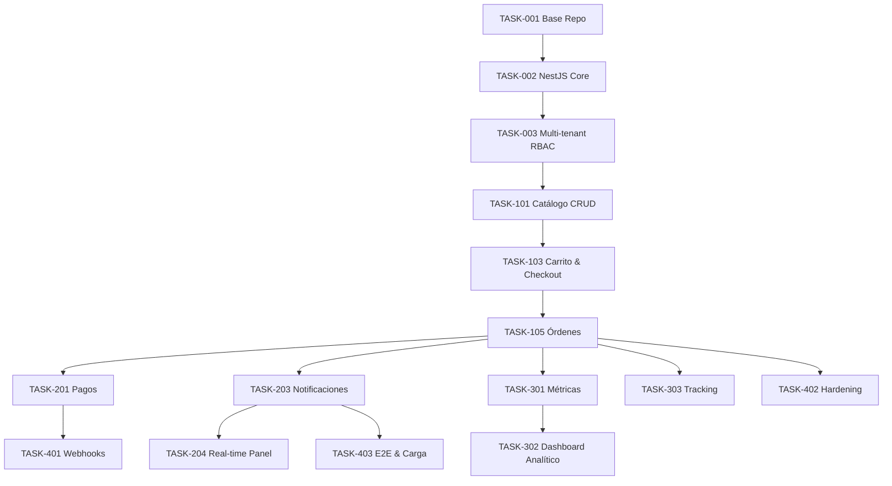

# PRD: Sistema Integral de Pedidos Multirubro
Generated: 2025-11-07
Version: 1.1

## Table of Contents
1. Source Ticket Reference
2. Technical Interpretation
3. Functional Specifications
4. Technical Requirements & Constraints
5. User Stories with Acceptance Criteria
6. Task Breakdown Structure
7. Dependencies & Integration Points
8. Risk Assessment & Mitigation
9. Testing & Validation Requirements
10. Monitoring & Observability
11. Success Metrics & Definition of Done
12. Technical Debt & Future Considerations
13. Appendices
14. Extended Architecture Decisions & Improvements

---

## 1. Source Ticket Reference
- Ticket: Internal Planning Document
- Title: Sistema Integral de Pedidos Multirubro
- Status: PRD Development
- Original User Story: Como negocio de cualquier rubro, quiero vender y gestionar pedidos online con seguimiento y notificaciones en tiempo real, para optimizar mis ventas y operación.
- Business Acceptance Criteria:
  - Gestión de catálogo, pedidos y pagos.
  - Seguimiento y notificaciones en tiempo real.
  - Panel administrativo con métricas, roles y permisos.
  - Integraciones previstas mediante webhooks.

## 2. Technical Interpretation

### Business → Technical
- Catálogo dinámico → Servicio de productos, categorías y variantes con imágenes en S3-compatible.
- Carrito y checkout → Servicio de carrito y órdenes con pricing engine (impuestos, descuentos, propinas, envío).
- Pagos (pasarelas múltiples) → Módulo de pagos con estrategia provider-agnostic + webhooks de confirmación.
- Seguimiento y notificaciones en tiempo real → WebSockets + FCM y colas Redis/BullMQ.
- Panel administrativo multi-rol → RBAC con JWT y scopes por acción.
- Preparación para integraciones → Endpoints /api/webhooks/* con verificación HMAC.
- Escalabilidad → Monolito modular NestJS con DDD light; listo para extraer microservicios.

### Assumptions
- Multi-tenant desde el inicio (single DB con aislamiento por tenant_id y row-level filters).
- PWA para cliente; panel admin web. Apps nativas fuera de alcance inicial.
- MercadoPago como primer gateway en LATAM; Stripe como segunda opción; efectivo/transferencia como manual.
- Postgres como DB principal; Redis para cache/colas; S3-compatible (Cloudflare R2) para medios.
- Infra inicial: Docker Compose (dev) y contenedores en producción (ECS/Fargate o Kubernetes más adelante).

## 3. Functional Specifications

### 3.1 Core Requirements
- REQ-001 Catálogo y Productos (P0)
  - CRUD productos, categorías, variantes, addons, stock, precios, impuestos, horarios de disponibilidad.
  - Búsqueda y filtros (texto, categoría, precio, disponibilidad). Imágenes.
  - Edge: productos sin stock, horarios cerrados, variantes incompatibles.
  - Errores: VALIDATION_ERROR (datos inválidos), STOCK_EXHAUSTED, PRODUCT_INACTIVE.
- REQ-002 Carrito & Checkout (P0)
  - Carrito persistente (anónimo → autenticado), cálculo de totales, cupones, propinas, dirección y método de entrega.
  - Edge: precios actualizados en checkout, stock insuficiente, zona no cubierta.
  - Errores: PRICE_CHANGED (recalcular), OUT_OF_STOCK_LINE, DELIVERY_ZONE_UNSUPPORTED, SCHEDULE_CLOSED.
- REQ-003 Órdenes (P0)
  - Estados: pendiente → confirmado → preparación → en_camino → entregado | cancelado.
  - SLA por estado y auditoría completa.
  - Edge: transición inválida, pago no conciliado, intento de cancelar en estado final.
  - Errores: INVALID_STATE_TRANSITION, PAYMENT_NOT_SETTLED, ORDER_LOCKED.
- REQ-004 Pagos (P0)
  - Integración MercadoPago (checkout + webhooks). Manual: efectivo/transferencia.
  - Conciliación automática de pago y actualización de estado.
  - Edge: webhook duplicado, desincronización estado proveedor.
  - Errores: PAYMENT_PROVIDER_ERROR, DUPLICATE_WEBHOOK, SIGNATURE_INVALID.
- REQ-005 Notificaciones (P0)
  - Push (FCM), WebSockets al cliente y panel admin; plantillas por evento.
  - Edge: canal no disponible, exceso de tamaño payload.
  - Errores: CHANNEL_UNAVAILABLE, TEMPLATE_NOT_FOUND.
- REQ-006 Autenticación y Roles (P0)
  - JWT, refresh tokens, RBAC (dueño, manager, cajero, cocina, repartidor, cliente).
  - Edge: refresh expirado, revocación, escalada de privilegios evitada.
  - Errores: TOKEN_EXPIRED, TOKEN_REVOKED, INSUFFICIENT_ROLE.
- REQ-007 Panel Admin (P0)
  - Dashboard, gestión catálogo, gestión pedidos en tiempo real, configuración negocio, zonas de entrega, horarios.
  - Edge: filtros complejos, paginación grande.
- REQ-008 Analítica (P1)
  - Ventas por periodo, productos top, clientes frecuentes, medios de pago.
- REQ-009 Tracking & Logística (P1)
  - Asignación de repartidor, tracking básico por estado, geocoding opcional.
- REQ-010 Integraciones Webhooks (P1)
  - /api/webhooks/{whatsapp,telegram,payment-status,notifications} con firma.

### 3.4 Esquema Unificado de Respuestas de Error
```json
{
  "success": false,
  "error": {
    "code": "VALIDATION_ERROR",
    "message": "Campo 'email' es requerido",
    "details": [{"field": "email", "issue": "required"}],
    "traceId": "ad3b9f42-..."
  }
}
```
Campos: code (estable), message (humano), details (opcional), traceId (correlación). Log de auditoría incluye actor, entidad, diff.

### 3.2 User Workflows


### 3.3 Business Rules
- Validación de horarios y zonas antes de confirmar pedido.
- Cálculo de impuestos y descuentos por línea y total.
- Cancelación: ventana configurada; devolución si pago ya capturado (depende gateway).
- Control de stock: decremento al confirmar; reabastecimiento al cancelar.
- Roles: acciones permitidas por scope.

## 4. Technical Requirements & Constraints

### 4.1 System Architecture
```
┌─────────────┐     ┌─────────────┐     ┌──────────────┐     ┌──────────┐
│   Frontend  │────▶│  API NestJS │────▶│  PostgreSQL  │◀───▶│  Redis   │
└─────────────┘     └─────────────┘     └──────────────┘     └──────────┘
        │                   │                    │                  │
        ▼                   ▼                    ▼                  ▼
   Next.js PWA         Swagger/OpenAPI        S3 (R2)         BullMQ/Queues
```

### 4.2 Data Models (principales, simplificado)
- Tenant{id, name, slug}
- User{id, email, password_hash, roles[], tenant_id}
- Product{id, tenant_id, name, sku, price, tax_rate, stock, images[], active}
- Category{id, tenant_id, name}
- ProductCategory{product_id, category_id}
- Variant{id, product_id, name, price_delta}
- Addon{id, product_id, name, price}
- Cart{id, tenant_id, user_id|null, items[]}
- Order{id, tenant_id, user_id, items[], totals, status, address, delivery_method, payment_status}
- Payment{id, order_id, provider, amount, status, external_id}
- Notification{id, tenant_id, event, channels[], payload, delivered_at}
- AuditLog{id, tenant_id, actor_id, action, entity, entity_id, diff, at}

### 4.3 API Contracts (muestras)
```yaml
POST /api/v1/auth/login
Request: { email: string, password: string }
Responses:
  200: { token: string, refreshToken: string, user: {id,email,roles} }
  401: { code: INVALID_CREDENTIALS }

GET /api/v1/catalog/products?search=&category=&page=&pageSize=
200: { data: Product[], total: number }

POST /api/v1/orders
Request: { items: [{productId, qty, variantId?, addons?:[]}], address, deliveryMethod, paymentMethod, coupon? }
201: { orderId, status: "pendiente", totals, payment:{provider, initPoint?} }

POST /api/v1/payments/mercadopago/webhook
Header: X-Signature
Body: provider payload
200: { ok: true }
```

### 4.4 Performance Requirements
- P95 API < 200ms (lecturas), P95 < 500ms (escrituras intensas).
- 1K pedidos/hora/tenant pico; 5K productos/tenant; 1K usuarios concurrentes global.
- Disponibilidad 99.9%; colas para desacoplar notificaciones y webhooks.

### 4.5 Security Requirements
- JWT HS256/RS256; refresh tokens rotativos; CSRF protection en cookies si aplica.
- Validaciones JOI/Class-Validator; sanitización; limit rate; helmet; CORS estricto por tenant domain.
- RBAC con scopes por endpoint; auditoría de cambios.
- Webhooks con firma HMAC y replay protection.

### 4.6 Estrategia Multi-Tenant
- Aislamiento lógico por tenant_id en todas las tablas (FK obligatoria).
- Repositorios aplican always-on filter (WHERE tenant_id = $ctx.tenant).
- Validación en capa de autorización: usuario solo opera dentro de tenant activo.
- Posible evolución: Row Level Security nativa Postgres para capas críticas (Órdenes, Pagos).
- Migración a multi-sucursal: agregar branch_id; compuesta (tenant_id, branch_id).

### 4.7 Caching & Queueing
- Redis: caché de catálogo (TTL 300s), tokens de sesión (lista revocación), rate limiting (sliding window), locks (setnx) para evitar doble procesamiento de webhooks.
- BullMQ queues:
  - notifications.send
  - payments.reconcile
  - analytics.rollup (procesos nocturnos)
- Retries exponenciales (max 5) + dead-letter queue para inspección manual.

### 4.8 Versionado de API
- Prefijo /api/v1 inicialmente; romper compatibilidad → /api/v2.
- Header X-Deprecated en endpoints próximos a retiro; documentación en Swagger con sunset date.

### 4.9 Migraciones & Ciclo de Datos
- Herramienta: Prisma Migrate + scripts verificados en staging.
- Convención: número secuencial + descripción.
- Rollback: mantener script inverso cuando no sea trivial.
- Retención de logs: 365 días (archivado S3 frío). Purga soft-delete para productos inactivos > 180 días.

### 4.10 Threat Model (Resumen)
- Actores: usuario legítimo, atacante externo, insider con rol limitado.
- Vectores: escalada de privilegios (mitigar con RBAC granular), inyección (sanitización y parametrización), replays webhooks (nonce + timestamp), scraping catálogo (rate limit + ETag), exfiltración datos multi-tenant (pruebas automáticas).
- Mitigaciones mapeadas en Security Requirements.

### 4.11 Observabilidad Técnica Ampliada
- Métricas Prometheus (nombres): http_requests_total{route,status}, http_request_duration_seconds_bucket, queue_jobs_processed_total{queue,status}, db_query_duration_ms_bucket, tenant_active_users_gauge.
- Tracing: OpenTelemetry (traceId propagado en X-Request-Id). Export a Jaeger/Tempo.
- Correlación: cada error incluye traceId y se vincula a log estructurado.

## 5. User Stories with Acceptance Criteria

### USR-001 Autenticación Cliente (P0)
Como cliente quiero iniciar sesión para ver mi historial y agilizar el checkout.
- A/C:
  - Login con email/password y JWT + refresh.
  - Rate limit de intentos; mensajes sin enumeración de usuarios.
  - Sesión PWA persistente 30 días (refresh token seguro).

### USR-002 Catálogo y Búsqueda (P0)
Como cliente quiero ver y filtrar productos para encontrar lo que busco.
- A/C:
  - Listado paginado por categoría y búsqueda full-text.
  - Productos sin stock aparecen deshabilitados.

### USR-003 Carrito y Checkout (P0)
Como cliente quiero pagar y recibir confirmación del pedido.
- A/C:
  - Cálculo de totales, impuestos, cupones y propinas.
  - Validación de zona/horario antes de confirmar.
  - Redirección a gateway y actualización por webhook.

### USR-004 Gestión Pedidos Admin (P0)
Como operador quiero ver pedidos en tiempo real y cambiar estados.
- A/C:
  - Vista Kanban por estados; cambios con arrastrar y soltar.
  - Notificación al cliente en cada cambio.

### USR-005 Roles y Permisos (P0)
Como dueño quiero controlar el acceso del equipo.
- A/C:
  - Roles predefinidos y permisos por acción.
  - Auditoría de acciones críticas.

### USR-006 Analítica (P1)
- A/C: métricas de ventas, top productos, clientes frecuentes con filtros por fecha.

### USR-007 Tracking Delivery (P1)
- A/C: asignación de repartidor y estados logísticos; ubicación opcional.

## 6. Task Breakdown Structure

Formato de tarea incluido en cada sección. Estimaciones en horas; esfuerzo por fase.

### Fase 1: Fundaciones (Semana 1-2)
- TASK-001: Base repo + CI/CD + Docker Compose (DevOps, 12h)
- TASK-002: Esqueleto NestJS + Postgres + Prisma + Redis + Swagger (Backend, 16h)
- TASK-003: Modelo multi-tenant y RBAC base (Backend, 16h)
- TASK-004: Next.js App (cliente PWA) + Tailwind + Auth base (Frontend, 20h)
- TASK-005: Admin Panel (Next.js app ruta /admin) + UI lib (Frontend, 24h)

### Fase 2: Núcleo de negocio (Semana 3-5)
- TASK-101: Módulo Catálogo (productos/categorías/variantes/addons) CRUD + upload a S3 (Backend, 32h)
- TASK-102: Catálogo UI + búsqueda y filtros (Frontend, 28h)
- TASK-103: Carrito y Checkout + pricing engine (Backend, 32h)
- TASK-104: Checkout UI + validaciones de zona/horario (Frontend, 28h)
- TASK-105: Órdenes + estados + auditoría (Backend, 28h)

### Fase 3: Pagos y Notificaciones (Semana 6-7)
- TASK-201: Integración MercadoPago + webhooks + conciliación (Backend, 32h)
- TASK-202: Pagos UI (Frontend, 20h)
- TASK-203: Notificaciones (FCM, WebSockets, plantillas) (Backend, 24h)
- TASK-204: Panel en tiempo real (sockets) (Frontend, 20h)

### Fase 4: Analítica y Tracking (Semana 8)
- TASK-301: Métricas y reportes (Backend, 20h)
- TASK-302: Dashboard analítico (Frontend, 20h)
- TASK-303: Tracking básico y asignación repartidor (Backend, 16h)

### Fase 5: Endpoints de Integración y Hardening (Semana 9)
- TASK-401: Endpoints /api/webhooks/* con HMAC y rate limit (Backend, 16h)
- TASK-402: Seguridad: Helmet, CORS multi-tenant, rate limiting, auditoría completa (Backend, 16h)
- TASK-403: Pruebas E2E críticas y pruebas de carga (QA, 24h)

#### Resumen
- Total Tasks: 20
- Total Esfuerzo: ~364h
- Duración: ~9 semanas
- Equipo: 1 Backend, 1 Frontend, 1 Fullstack/QA (parcial)

### Critical Path
```
TASK-002 → TASK-003 → TASK-101 → TASK-103 → TASK-105 → TASK-201 → TASK-204
                     ↘ TASK-104
```

### 6.1 Acceptance Criteria Clave por Tarea (Extracto)
- TASK-002: Swagger expone /health y /api/v1/auth/login; migraciones iniciales aplican; pruebas smoke pasan.
- TASK-101: CRUD productos (POST/GET/PUT/DELETE) con validación stock; carga imágenes multi-part a R2 con URL firmada.
- TASK-103: Pricing engine soporta impuestos por línea, cupones porcentaje/fijo, propina y recalculo en menos de 50ms P95.
- TASK-201: Webhook MercadoPago idempotente (segundo POST responde 200 sin duplicar); payment.status se actualiza.
- TASK-203: Notificación de cambio estado orden llega < 2s P95 vía WebSocket y push (si token FCM registrado).

### 6.2 Diagrama de Dependencias Detallado


### 6.3 Riesgos de Dependencias & Mitigación
- Cuello de botella en T103 (pricing) retrasa múltiples módulos → Mitigar iniciando prototipo temprano (spike) paralelo a T101 UI.
- T201 depende de estabilidad de T105 estados orden → Definir contrato estable antes de comenzar integración.
- T203 y T204 comparten canal WebSocket → Diseñar namespace y event schema antes de desarrollo concurrente.

### 6.4 Buffer & Plan Paralelización
- Paralelizar T101 UI (T102) mientras backend finaliza validaciones menos críticas.
- Reservar 10% tiempo por sprint para refactor y deuda emergente.

## 7. Dependencies & Integration Points

- Internas: Auth, Catálogo, Carrito, Órdenes, Pagos, Notificaciones, Analítica.
- Externas: MercadoPago, FCM, S3, Email (SES/SendGrid opcional), Maps (opc.).

### Integración ejemplo (pseudo)
```ts
// PaymentService
async handleWebhook(payload, signature) {
  verifyHmac(signature, payload)
  const event = mapProviderEvent(payload)
  switch(event.type){
    case 'payment_succeeded': await orders.pay(event.orderId)
  }
}
```

## 8. Risk Assessment & Mitigation
| Riesgo | Probabilidad | Impacto | Mitigación |
|--------|--------------|---------|-----------|
| Downtime pasarela pagos | Media | Alto | Reintentos en cola + conciliación diaria + fallback a pago manual |
| Picos de tráfico (campañas) | Alta | Medio | Auto-scaling + Redis cache + circuit breakers |
| Compromiso JWT/refresh | Baja | Crítico | Rotación tokens, almacenamiento seguro, invalidación lista revocación |
| Fuga datos multi-tenant | Baja | Crítico | Filtros sistemáticos + pruebas automáticas + revisión código repositorios |
| Duplicación webhooks | Media | Medio | Idempotency keys + locks Redis (setnx) |
| Latencia notificaciones > SLA | Media | Medio | Monitoreo cola + métricas tiempo en cola + auto-scaling workers |
| Desalineación esquema catálogo | Media | Bajo | ADR para cambios + migraciones versionadas + tests contrato |

## 9. Testing & Validation Requirements
- Unit: >80% módulos core (pricing, órdenes, pagos).
- Integración: API endpoints críticos.
- E2E: Checkout completo, cambio de estados, webhook pago.
- Performance: carga 500 rps pico lectura; 100 rps escritura.
- Seguridad: OWASP Top 10, fuzzing inputs, escaneo deps.

### 9.1 Matriz de Cobertura
| Módulo | Unit | Integración | E2E |
|--------|------|-------------|-----|
| Auth | 85% líneas | /login /refresh /logout | Login + persistencia |
| Catálogo | 80% | CRUD + filtros | Búsqueda y visualización |
| Carrito/Checkout | 85% | Recalculo precios | Flujo completo compra |
| Órdenes | 85% | Cambios estado | Timeline estados |
| Pagos | 90% lógica firma | Webhook idempotente | Pago exitoso/cancelado |
| Notificaciones | 80% plantillas | Emisión evento | Recepción push/socket |

### 9.2 Jobs & Validaciones Programadas
- Rollup analítico nocturno (analytics.rollup) con verificación de consistencia (comparar totales vs órdenes del día).
- Limpieza tokens revocados > 30 días.
- Verificación integridad stock (productos con stock negativo alertar).

## 10. Monitoring & Observability
- Logs estructurados (Pino/winston), correlación por request-id y tenant-id.
- Métricas: latencia API, throughput, errores, colas.
- Alertas: p95 > 1s por 5 min; error rate >1%; colas atrasadas; memoria/CPU.

### 10.1 Dashboard Inicial
- Panel API: latencia p50/p95, throughput, errores 4xx/5xx, slow queries top 10.
- Panel Pagos: tasa éxito vs fallo, duración conciliación.
- Panel Notificaciones: tiempo en cola, entregas/minuto, tasa error canal.

### 10.2 Error Budgets
- SLO disponibilidad 99.9% → presupuesto error mensual ~43m.
- Alertas escalonadas (warning a 50% consumo, critical a 75%).

## 11. Success Metrics & DoD
- p95 < 200/500ms; uptime 99.9%.
- < 5 bugs/sprint; NPS > 50; adopción > 60% en 30 días.
- DoD: código revisado, tests verdes, docs Swagger, dashboards y alertas, runbook y feature flags.

### 11.1 SLOs Formales
- Catálogo GET p95 < 200ms.
- Checkout POST p95 < 450ms.
- Tiempo notificación estado orden < 2s p95.
- Webhook pagos procesado < 5s p95.

### 11.2 Métricas de Producto Adicionales
- Tasa conversión visita → pedido.
- Tiempo promedio preparación pedido.
- % pedidos cancelados por causa (stock, cliente, pago fallido).

## 12. Technical Debt & Future Considerations
- MFA, Social Login, POS, geolocalización avanzada, microservicios por dominio, multi-sucursal avanzada.
- Data warehouse para analítica histórica.
 - Multi-moneda y reglas fiscales por país.
 - Motor de promociones avanzado (BOGO, bundles, happy hour).
 - Recomendaciones personalizadas (ML) basado en historial.

## 13. Appendices
- Glosario: JWT, RBAC, BullMQ, HMAC, PWA, RLS.
- Referencias: OWASP, RFC7519 JWT, ADR internos.
- Change Log:
  - v1.1 (2025-11-07) - Ampliación: multi-tenant detallado, caching, versionado API, threat model, métricas, SLOs, riesgos tabulados.
  - v1.0 (2025-11-07) - Borrador inicial.

## 14. Extended Architecture Decisions & Improvements

### ADR Snapshot
- ADR-001: Monolito modular NestJS (razón: velocidad inicial, menor sobrecarga operativa, boundaries claros para futura extracción).
- ADR-002: Multi-tenant lógico sobre Postgres (evita overhead multi DB; RLS evaluado para fase 2). Riesgo de fuga mitigado con pruebas automáticas.
- ADR-003: BullMQ sobre Redis vs RabbitMQ (simplicidad en stack, suficiente para volumen estimado fase 1).
- ADR-004: PWA para cliente (reduce time-to-market, offline básico caché catálogo).

### Patrones Adoptados
- Repository + Service + Controller en backend; DTOs validados con Class-Validator.
- EventEmitter interno para desacoplar notificaciones de cambios de estado (ordenActualizada → cola notificaciones).
- Idempotency para webhooks y pagos (hash de payload + external_id).
- Circuit Breaker (lógica futura para gateways múltiples) interfaz `PaymentProvider`.

### Escalabilidad Futuras Extracciones
- Catálogo y Órdenes como primeros candidatos a microservicios independientes (alto cambio + alto throughput).
- Pagos aislado para certificaciones y cumplimiento (PCI desde fase posterior).
- Notificaciones como servicio push centralizado (fan-out).

### Estrategia Caching Detallada
- CatalogCache: key `catalog:tenant:{id}:v{schemaHash}` invalidado en cambios CRUD.
- PricingCache: cálculos de cupones y reglas (TTL corto 60s).
- Auth: lista revocación en Redis set `revoked:tokens`.

### Métricas de Capacidad Inicial (Estimación)
- Memoria catálogo (~5K productos * 1KB) ≈ 5MB por tenant en cache caliente.
- Jobs notificaciones pico: 200/min en eventos estado (dimensionar 3 workers).
- WebSockets concurrentes esperados: 1K global → un nodo suficiente (escala horizontal con sticky sessions si >5K).

### Plan de Hardening Fase 1->2
- Añadir RLS en tablas sensibles.
- Implementar Content Security Policy estricta en frontend.
- Escaneo SAST/DAST en pipeline CI.

### Auditoría & Trazabilidad
- Cada cambio estado orden agrega registro AuditLog con diff JSON (antes/después).
- Export mensual CSV para cumplimiento y análisis.

### Backlog Técnico Priorizado (Top 5)
1. Implementar RLS crítica (seguridad multi-tenant).
2. Mejorar pricing engine para promociones complejas.
3. Introducir feature flags por tenant (lanzamientos controlados).
4. Integrar tracing completo OpenTelemetry.
5. Implementar metrics anomaly detection (pico latencia).
