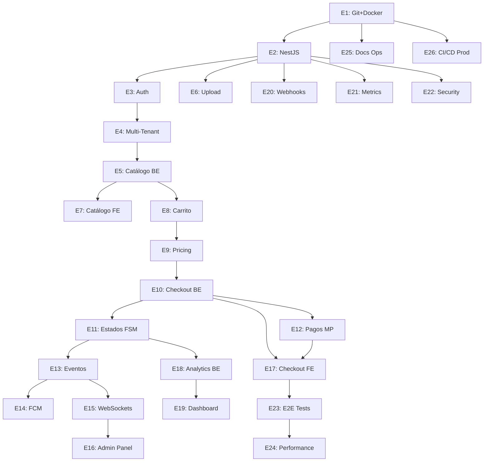

# Resumen de Entregables - Sistema de Pedidos

**Versión**: 1.0
**Última actualización**: 2025-11-07 19:02
**Referencia**: [Plan Completo](project_plan.md)

---

## Índice de Entregables

### Fase 1: Fundamentos (Semanas 1-2)
- [E1: Setup Git + Docker + CI/CD](#e1-setup-completo)
- [E2: Backend NestJS + Swagger](#e2-backend-nestjs)
- [E3: Autenticación JWT](#e3-autenticación-jwt)
- [E4: Multi-Tenant + RBAC](#e4-multi-tenant--rbac)

### Fase 2: Core Backend (Semanas 3-5)
- [E5: Módulo Catálogo Backend](#e5-módulo-catálogo-backend)
- [E6: Upload de Imágenes](#e6-upload-de-imágenes)
- [E7: Catálogo Frontend](#e7-catálogo-frontend)
- [E8: Módulo Carrito](#e8-módulo-carrito)
- [E9: Pricing Engine](#e9-pricing-engine)
- [E10: Checkout Backend](#e10-checkout-backend)

### Fase 3: Órdenes y Estados (Semanas 6-7)
- [E11: Sistema de Estados (FSM)](#e11-sistema-de-estados-fsm)
- [E12: Integración MercadoPago](#e12-integración-mercadopago)
- [E13: Sistema de Eventos](#e13-sistema-de-eventos)
- [E14: Notificaciones FCM](#e14-notificaciones-fcm)

### Fase 4: Tiempo Real y Frontend (Semanas 8-9)
- [E15: WebSockets](#e15-websockets)
- [E16: Panel Admin Órdenes](#e16-panel-admin-órdenes)
- [E17: Checkout Frontend](#e17-checkout-frontend)
- [E18: Analítica Backend](#e18-analítica-backend)

### Fase 5: Completitud y Despliegue (Semanas 10-13)
- [E19: Dashboard Analítico](#e19-dashboard-analítico)
- [E20: Webhooks Genéricos](#e20-webhooks-genéricos)
- [E21: Métricas Prometheus](#e21-métricas-prometheus)
- [E22: Hardening Seguridad](#e22-hardening-seguridad)
- [E23: Tests E2E Completos](#e23-tests-e2e-completos)
- [E24: Tests de Performance](#e24-tests-de-performance)
- [E25: Documentación Operacional](#e25-documentación-operacional)
- [E26: CI/CD Producción](#e26-cicd-producción)

---

## E1: Setup Completo
**Semana**: 1 | **Duración**: 20h | **Prioridad**: P0

### Objetivo
Repositorio GitHub + Docker Compose + GitHub Actions base

### Entregables
- ✅ Repositorio con branches main/develop
- ✅ Docker Compose con Postgres, Redis, PgAdmin, Redis Commander
- ✅ Makefile con comandos comunes
- ✅ GitHub Actions para build y smoke tests
- ✅ README con instrucciones de setup

### Tests
```bash
make test-infra  # Smoke tests de todos los servicios
```

---

## E2: Backend NestJS
**Semana**: 1 | **Duración**: 24h | **Prioridad**: P0 | **Depende**: E1

### Objetivo
API base con Swagger, health checks, y CI específico

### Entregables
- ✅ NestJS en Docker con hot reload
- ✅ Swagger en /api/docs
- ✅ Health checks (/health, /health/ready, /health/live)
- ✅ Logger estructurado (Pino)
- ✅ Error handling global
- ✅ GitHub Actions para backend (lint, test, build)

### Endpoints
```
GET /health          # Health completo
GET /health/ready    # Readiness probe
GET /health/live     # Liveness probe
GET /api/docs        # Swagger UI
```

### Tests
```bash
make test            # Unit tests
make test-e2e        # Integration tests
make lint            # ESLint
```

---

## E3: Autenticación JWT
**Semana**: 2 | **Duración**: 24h | **Prioridad**: P0 | **Depende**: E2

### Objetivo
Sistema completo de auth con JWT RS256 y refresh tokens

### Entregables
- ✅ Entity User con bcrypt (12 rounds)
- ✅ JWT access token (15min) y refresh token (30d)
- ✅ Endpoints: register, login, refresh, logout, me
- ✅ Guards: JwtAuthGuard, Public decorator
- ✅ Refresh token rotation
- ✅ Rate limiting en auth endpoints
- ✅ Secrets en GitHub Actions

### Endpoints
```
POST /api/v1/auth/register
POST /api/v1/auth/login
POST /api/v1/auth/refresh
POST /api/v1/auth/logout
GET  /api/v1/auth/me
```

### Tests
```typescript
✓ Should register new user
✓ Should login and return tokens
✓ Should refresh access token
✓ Should reject expired token
✓ Should rate limit login attempts (>5/min)
```

---

## E4: Multi-Tenant + RBAC
**Semana**: 2 | **Duración**: 20h | **Prioridad**: P0 | **Depende**: E3

### Objetivo
Aislamiento por tenant y control de acceso por roles

### Entregables
- ✅ Entity Tenant
- ✅ TenantContext con AsyncLocalStorage
- ✅ Middleware/Guard de tenant (subdomain/header)
- ✅ Roles: OWNER, MANAGER, CASHIER, KITCHEN, DELIVERY, CUSTOMER
- ✅ RolesGuard con @Roles() decorator
- ✅ Filtros automáticos por tenant_id en repos

### Tests
```typescript
✓ Should extract tenant from subdomain
✓ Should reject request without valid tenant
✓ Should prevent cross-tenant data access
✓ Should enforce role-based access
✓ OWNER can manage products
✓ CASHIER cannot manage products
```

---

## E5: Módulo Catálogo Backend
**Semana**: 3 | **Duración**: 28h | **Prioridad**: P0 | **Depende**: E4

### Objetivo
CRUD completo de productos con búsqueda y filtros

### Entregables
- ✅ Entities: Product, Category, ProductCategory, Variant, Addon
- ✅ Prisma migrations
- ✅ CRUD endpoints con paginación
- ✅ Búsqueda full-text
- ✅ Filtros: categoría, precio min/max, activo
- ✅ Cache Redis (TTL 5min)
- ✅ Soft delete

### Endpoints
```
GET    /api/v1/products          # List con filtros y paginación
GET    /api/v1/products/:id      # Detalle
POST   /api/v1/products          # Crear (OWNER/MANAGER)
PUT    /api/v1/products/:id      # Actualizar (OWNER/MANAGER)
DELETE /api/v1/products/:id      # Soft delete (OWNER)
GET    /api/v1/categories        # List categorías
```

### Tests
```typescript
✓ Should paginate products
✓ Should filter by category
✓ Should search by name
✓ Should cache catalog listing
✓ Should invalidate cache on update
✓ Should prevent cross-tenant access
```

---

## E6: Upload de Imágenes
**Semana**: 3 | **Duración**: 16h | **Prioridad**: P1 | **Depende**: E2

### Objetivo
Subida de imágenes a S3/R2 con validaciones

### Entregables
- ✅ Integración S3 SDK (AWS o Cloudflare R2)
- ✅ Presigned URLs para upload
- ✅ Validación MIME (jpeg, png, webp)
- ✅ Validación tamaño (<5MB)
- ✅ Endpoint de upload
- ✅ Secrets de AWS/R2 en GitHub

### Endpoint
```
POST /api/v1/media/upload
```

### Tests
```typescript
✓ Should upload valid image
✓ Should reject invalid MIME type
✓ Should reject oversized file
✓ Should return public URL
✓ Presigned URL should expire
```

---

## E7: Catálogo Frontend
**Semana**: 4 | **Duración**: 24h | **Prioridad**: P0 | **Depende**: E5, E6

### Objetivo
UI de catálogo con listado, búsqueda, y filtros

### Entregables
- ✅ Next.js App Router en Docker
- ✅ Servicio en docker-compose
- ✅ Cliente API tipado
- ✅ Página de catálogo con ProductCard
- ✅ Paginación infinita
- ✅ Filtros laterales
- ✅ Búsqueda con debounce (300ms)
- ✅ Skeleton loaders
- ✅ GitHub Actions para frontend (lint, build, Lighthouse)

### Docker
```yaml
frontend:
  build: ./frontend
  ports:
    - "3000:3000"
  volumes:
    - ./frontend:/app
  depends_on:
    - api
```

### Tests
```typescript
✓ Should display products
✓ Should filter by category
✓ Should search products
✓ Should paginate
✓ Lighthouse score >90
```

---

## E8: Módulo Carrito
**Semana**: 4 | **Duración**: 20h | **Prioridad**: P0 | **Depende**: E5

### Objetivo
Gestión de carrito persistente (anónimo y autenticado)

### Entregables
- ✅ Entities: Cart, CartItem
- ✅ Persistencia Redis (anon) y DB (auth)
- ✅ Endpoints CRUD de carrito
- ✅ Merge anon → auth al login
- ✅ TTL 7 días para carritos anónimos
- ✅ Validación de stock

### Endpoints
```
GET    /api/v1/cart
POST   /api/v1/cart/items
PUT    /api/v1/cart/items/:id
DELETE /api/v1/cart/items/:id
POST   /api/v1/cart/merge
```

### Tests
```typescript
✓ Should create anonymous cart
✓ Should merge cart on login
✓ Should validate stock availability
✓ Should expire after TTL
```

---

## E9: Pricing Engine
**Semana**: 5 | **Duración**: 20h | **Prioridad**: P0 | **Depende**: E8

### Objetivo
Cálculo de totales con impuestos, descuentos, propina, envío

### Entregables
- ✅ Service puro (sin deps externas)
- ✅ Cálculo subtotal por línea
- ✅ Impuestos por producto (tax_rate)
- ✅ Descuentos: porcentaje y fijo
- ✅ Propina opcional
- ✅ Costo envío por zona
- ✅ Redondeo a 2 decimales
- ✅ Entity Coupon

### Tests
```typescript
✓ Should calculate subtotal
✓ Should apply taxes correctly
✓ Should apply percentage discount
✓ Should apply fixed discount
✓ Should calculate with tip
✓ Should add shipping cost
✓ Performance <10ms P95 (20 items)
✓ 100+ test cases
```

---

## E10: Checkout Backend
**Semana**: 5 | **Duración**: 24h | **Prioridad**: P0 | **Depende**: E9

### Objetivo
Creación de órdenes con validaciones

### Entregables
- ✅ Entity Order, OrderItem
- ✅ Validaciones: horario, zona, stock
- ✅ Endpoint POST /orders
- ✅ Integración pricing engine
- ✅ Bloqueo de stock (decremento)
- ✅ Idempotency key
- ✅ Lock Redis durante creación

### Endpoint
```
POST /api/v1/orders
```

**Request**:
```json
{
  "items": [
    {
      "productId": "uuid",
      "quantity": 2,
      "variantId": "uuid",
      "addons": ["uuid1", "uuid2"]
    }
  ],
  "address": {...},
  "deliveryMethod": "delivery",
  "paymentMethod": "mercadopago",
  "coupon": "DESCUENTO10"
}
```

### Tests
```typescript
✓ Should create order
✓ Should validate business hours
✓ Should validate delivery zone
✓ Should validate stock
✓ Should be idempotent
✓ Should handle concurrent requests
```

---

## E11: Sistema de Estados (FSM)
**Semana**: 6 | **Duración**: 20h | **Prioridad**: P0 | **Depende**: E10

### Objetivo
Máquina de estados para órdenes con auditoría

### Entregables
- ✅ Estados: PENDING, CONFIRMED, PREPARING, IN_TRANSIT, DELIVERED, CANCELLED
- ✅ FSM con transiciones válidas
- ✅ Service de transiciones con validación por rol
- ✅ Entity AuditLog
- ✅ Endpoints de cambio de estado y timeline

### Endpoints
```
PATCH /api/v1/orders/:id/status
GET   /api/v1/orders/:id/timeline
```

### FSM
```
PENDING → CONFIRMED → PREPARING → IN_TRANSIT → DELIVERED
  ↓
CANCELLED
```

### Tests
```typescript
✓ Should allow valid transitions
✓ Should reject invalid transitions
✓ Should validate role permissions
✓ Should create audit log entry
✓ FSM matrix complete (all states × all states)
```

---

## E12: Integración MercadoPago
**Semana**: 6 | **Duración**: 28h | **Prioridad**: P0 | **Depende**: E10

### Objetivo
Procesamiento de pagos con webhook seguro

### Entregables
- ✅ SDK MercadoPago
- ✅ Entity Payment
- ✅ createPreference(order)
- ✅ Webhook con validación HMAC
- ✅ Idempotencia (external_id)
- ✅ Estados: PENDING, APPROVED, REJECTED, CANCELLED
- ✅ Secrets de MP en GitHub

### Endpoints
```
POST /api/v1/payments/mercadopago/preference
POST /api/v1/payments/mercadopago/webhook
```

### Tests
```typescript
✓ Should create payment preference
✓ Should return init_point URL
✓ Should validate webhook signature
✓ Should be idempotent
✓ Should update order status on approved
✓ Should handle rejected payment
```

---

## E13: Sistema de Eventos
**Semana**: 7 | **Duración**: 16h | **Prioridad**: P0 | **Depende**: E11

### Objetivo
Event-driven architecture con BullMQ

### Entregables
- ✅ EventEmitter de NestJS
- ✅ Eventos: order.created, order.status_changed, payment.completed, payment.failed
- ✅ BullMQ queues
- ✅ Retry exponencial (max 5)
- ✅ Dead Letter Queue

### Eventos
```typescript
// Emit
this.eventEmitter.emit('order.status_changed', {
  orderId,
  oldStatus,
  newStatus,
  userId,
  tenantId
});

// Listen
@OnEvent('order.status_changed')
async handleOrderStatusChanged(payload) {
  // Process event
}
```

### Tests
```typescript
✓ Should emit events
✓ Should process events asynchronously
✓ Should retry on failure
✓ Should move to DLQ after max retries
```

---

## E14: Notificaciones FCM
**Semana**: 7 | **Duración**: 20h | **Prioridad**: P0 | **Depende**: E13

### Objetivo
Push notifications a clientes

### Entregables
- ✅ Firebase Admin SDK
- ✅ Entity NotificationToken
- ✅ Service de notificaciones
- ✅ Templates por tipo de evento
- ✅ Handler de order.status_changed → notificación
- ✅ Job BullMQ: notifications.send
- ✅ Endpoint POST /notifications/register-token

### Tests
```typescript
✓ Should register FCM token
✓ Should send notification on order update
✓ Latency <2s P95
✓ Should retry on failure
✓ Should handle invalid tokens
```

---

## E15: WebSockets
**Semana**: 8 | **Duración**: 20h | **Prioridad**: P1 | **Depende**: E13

### Objetivo
Actualizaciones en tiempo real

### Entregables
- ✅ WebSocket Gateway (Socket.io)
- ✅ Namespaces por tenant
- ✅ Rooms por orden
- ✅ Auth JWT en conexión WS
- ✅ Eventos: order:update, order:new
- ✅ Integración con sistema de eventos

### Eventos WS
```typescript
// Cliente conecta
socket.emit('subscribe', { orderId: 'uuid' });

// Server notifica
io.to(orderId).emit('order:update', orderData);
```

### Tests
```typescript
✓ Should authenticate WS connection
✓ Should subscribe to order room
✓ Should receive order updates
✓ Should handle 1K concurrent connections
```

---

## E16: Panel Admin Órdenes
**Semana**: 8 | **Duración**: 28h | **Prioridad**: P0 | **Depende**: E15

### Objetivo
UI operativa con Kanban y tiempo real

### Entregables
- ✅ Layout admin con sidebar
- ✅ Vista Kanban por estado
- ✅ Drag & drop (react-beautiful-dnd)
- ✅ Modal de detalle de orden
- ✅ Filtros (fecha, estado, cliente)
- ✅ Integración WebSocket
- ✅ Audio en orden nueva

### Tests
```typescript
✓ Should display orders in Kanban
✓ Should drag order to change status
✓ Should receive new orders in real-time
✓ Should play sound on new order
```

---

## E17: Checkout Frontend
**Semana**: 9 | **Duración**: 28h | **Prioridad**: P0 | **Depende**: E10, E12

### Objetivo
UI de finalización de compra

### Entregables
- ✅ Página checkout con stepper
- ✅ Formulario dirección
- ✅ Selector método entrega
- ✅ Resumen con pricing en vivo
- ✅ Integración MercadoPago (iframe/redirect)
- ✅ Páginas resultado (success/pending/failure)

### Tests E2E
```typescript
✓ Should complete checkout flow
✓ Should validate address form
✓ Should recalculate totals
✓ Should redirect to MercadoPago
✓ Should show order confirmation
```

---

## E18: Analítica Backend
**Semana**: 9 | **Duración**: 20h | **Prioridad**: P1 | **Depende**: E11

### Objetivo
Métricas de negocio

### Entregables
- ✅ Entity AnalyticsRollup
- ✅ Job BullMQ: analytics.rollup (cron diario)
- ✅ Métricas: ventas, top productos, clientes frecuentes, medios pago
- ✅ Endpoints con cache (TTL 1h)

### Endpoints
```
GET /api/v1/analytics/sales?from=&to=
GET /api/v1/analytics/products/top
GET /api/v1/analytics/customers/frequent
```

### Tests
```typescript
✓ Should rollup daily data
✓ Data accuracy ±1% vs raw
✓ Response time <300ms P95
✓ Only OWNER/MANAGER access
```

---

## E19: Dashboard Analítico
**Semana**: 10 | **Duración**: 24h | **Prioridad**: P1 | **Depende**: E18

### Objetivo
Visualización de métricas

### Entregables
- ✅ Página dashboard admin
- ✅ Gráficos: ventas (línea), top productos (barra), medios pago (pie)
- ✅ Filtros de fecha
- ✅ KPI cards
- ✅ Export CSV opcional

### Tests
```typescript
✓ Should display charts
✓ Should filter by date range
✓ Should show correct KPIs
✓ Should export to CSV
```

---

## E20: Webhooks Genéricos
**Semana**: 10 | **Duración**: 16h | **Prioridad**: P1 | **Depende**: E2

### Objetivo
Endpoints para integraciones futuras

### Entregables
- ✅ POST /webhooks/whatsapp
- ✅ POST /webhooks/telegram
- ✅ POST /webhooks/notifications
- ✅ Validación HMAC
- ✅ Replay protection (timestamp + nonce)
- ✅ Rate limiting (10/min por IP)

### Tests
```typescript
✓ Should validate HMAC signature
✓ Should reject replay attacks
✓ Should rate limit
✓ Should log webhook events
```

---

## E21: Métricas Prometheus
**Semana**: 11 | **Duración**: 16h | **Prioridad**: P1 | **Depende**: E2

### Objetivo
Instrumentación completa

### Entregables
- ✅ @willsoto/nestjs-prometheus
- ✅ Métricas: http_request_duration_seconds, http_requests_total, db_query_duration_ms, queue_jobs_processed_total, active_websocket_connections
- ✅ Endpoint /metrics
- ✅ TraceId propagation
- ✅ OpenTelemetry básico

### Tests
```typescript
✓ Should expose metrics in Prometheus format
✓ Should track HTTP requests
✓ Should track DB queries
✓ Should correlate with traceId
```

---

## E22: Hardening Seguridad
**Semana**: 11 | **Duración**: 20h | **Prioridad**: P0 | **Depende**: E2+

### Objetivo
Mitigar OWASP Top 10

### Entregables
- ✅ Helmet (security headers)
- ✅ CORS multi-tenant
- ✅ Rate limiting global
- ✅ Input validation estricta
- ✅ Output sanitization
- ✅ CSP en frontend
- ✅ npm audit / Snyk
- ✅ OWASP ZAP tests

### Tests
```typescript
✓ Should have security headers
✓ Should enforce CORS
✓ Should rate limit
✓ Should sanitize inputs
✓ No critical vulnerabilities
```

---

## E23: Tests E2E Completos
**Semana**: 12 | **Duración**: 28h | **Prioridad**: P0 | **Depende**: E17+

### Objetivo
Cobertura end-to-end

### Entregables
- ✅ Playwright configurado
- ✅ Flujos: registro → catálogo → carrito → checkout → pago → seguimiento
- ✅ Flujo admin: login → órdenes → cambiar estado
- ✅ Data seeding automatizado
- ✅ CI ejecuta E2E
- ✅ Screenshots/videos en fallos

### Tests
```typescript
✓ User journey completo
✓ Admin journey completo
✓ Tests deterministas
✓ Ejecución <15min
```

---

## E24: Tests de Performance
**Semana**: 12 | **Duración**: 20h | **Prioridad**: P1 | **Depende**: E23

### Objetivo
Validar SLOs

### Entregables
- ✅ K6 o Artillery
- ✅ Escenarios: 500 rps lectura, 100 rps escritura, 1K WS concurrentes
- ✅ Profiling (Clinic.js)
- ✅ Documentación de bottlenecks

### Tests
```bash
✓ P95 catálogo <200ms
✓ P95 checkout <500ms
✓ P95 notificación <2s
✓ Sin errores 5xx
```

---

## E25: Documentación Operacional
**Semana**: 13 | **Duración**: 16h | **Prioridad**: P0 | **Depende**: E1+

### Objetivo
Runbook y guías

### Entregables
- ✅ docs/operations/runbook.md
- ✅ docs/operations/deployment.md
- ✅ README.md raíz actualizado
- ✅ CONTRIBUTING.md

### Contenido
- Troubleshooting común
- Procedimientos de escalación
- Rollback
- Setup producción
- Migraciones

---

## E26: CI/CD Producción
**Semana**: 13 | **Duración**: 24h | **Prioridad**: P0 | **Depende**: E25

### Objetivo
Deploy seguro a producción

### Entregables
- ✅ Pipeline completo: lint → test → build → E2E → deploy staging → deploy prod
- ✅ Feature flags (LaunchDarkly o custom)
- ✅ Blue-green o canary deployment
- ✅ Healthchecks en deployment
- ✅ Rollback automático si healthcheck falla
- ✅ Notificaciones Slack/Discord

### Tests
```bash
✓ Deploy to staging automático
✓ Deploy to prod manual con aprobación
✓ Rollback funciona <5min
✓ Feature flags activan/desactivan módulos
```

---

## Resumen de Métricas

| Fase | Entregables | Semanas | Horas Estimadas |
|------|-------------|---------|-----------------|
| Fase 1: Fundamentos | E1-E4 | 2 | 88h |
| Fase 2: Core Backend | E5-E10 | 3 | 132h |
| Fase 3: Órdenes | E11-E14 | 2 | 84h |
| Fase 4: Tiempo Real | E15-E18 | 2 | 96h |
| Fase 5: Completitud | E19-E26 | 4 | 164h |
| **TOTAL** | **26** | **13** | **564h** |

---

## Matriz de Dependencias



---

## Changelog

### v1.0 - 2025-11-07 19:02
- Resumen completo de 26 entregables
- Métricas por fase
- Matriz de dependencias visualizada
