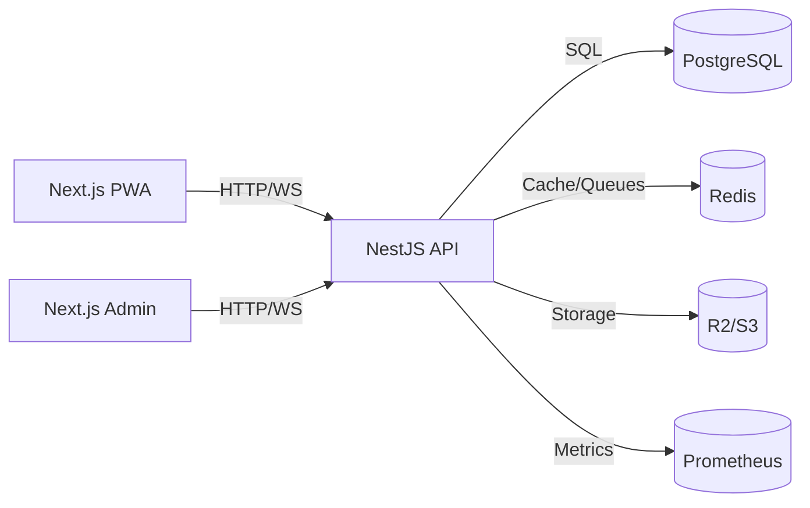

# Plan de Trabajo Operativo - Sistema Integral de Pedidos

**Versión**: 1.0
**Última actualización**: 2025-11-07 19:02
**Referencia**: [PEP](../pep/plan_ejecucion_proyecto.md) | [PRD](../prd/prd_sistema_integral_pedidos_20251107.md)
**Estado**: Aprobado

---

## Tabla de Contenidos

1. [Resumen Ejecutivo](#resumen-ejecutivo)
2. [Principios de Desarrollo](#principios-de-desarrollo)
3. [Entregables Fase 1 - Fundamentos](#fase-1-fundamentos-semanas-1-2)
4. [Entregables Fase 2 - Core Backend](#fase-2-core-backend-semanas-3-5)
5. [Entregables Fase 3 - Frontend e Integración](#fase-3-frontend-e-integración-semanas-6-8)
6. [Entregables Fase 4 - Pagos y Tiempo Real](#fase-4-pagos-y-tiempo-real-semanas-9-10)
7. [Entregables Fase 5 - Hardening y Despliegue](#fase-5-hardening-y-despliegue-semanas-11-13)
8. [Matriz de Dependencias](#matriz-de-dependencias)
9. [Cronograma y Recursos](#cronograma-y-recursos)
10. [Gestión de Riesgos](#gestión-de-riesgos)

---

## Resumen Ejecutivo

Este plan define **26 entregables independientes y testeables** para desarrollar el Sistema Integral de Pedidos Multirubro en **13 semanas**.

### Características Clave

- ✅ **Docker First**: Contenedores desde el día 1
- ✅ **GitHub First**: Git, CI/CD, y PR workflow desde el inicio
- ✅ **Test-Driven**: Cada entregable 100% testeable
- ✅ **API First**: Backend completo antes de frontend
- ✅ **Documentación Continua**: Docs actualizados con código

### Métricas del Proyecto

| Métrica | Valor |
|---------|-------|
| **Total Entregables** | 26 |
| **Duración Total** | 13 semanas |
| **Entregables Independientes** | 20/26 (77%) |
| **Cobertura de Tests Mínima** | 80% en módulos core |
| **SLO Latencia API** | P95 < 200ms (read), < 500ms (write) |
| **SLO Disponibilidad** | 99.9% (uptime) |

---

## Principios de Desarrollo

### 1. Docker First
```yaml
# Todos los servicios en contenedores
services:
  - postgres
  - redis
  - api (NestJS)
  - frontend (Next.js)
  - pgadmin
  - redis-commander
```

**Beneficios**:
- Reproducibilidad perfecta entre entornos
- Onboarding de desarrolladores en <5 minutos
- Paridad dev/staging/prod

### 2. GitHub First
```
main (producción)
  ├── develop (integración)
  │     ├── feature/E1-docker-setup
  │     ├── feature/E3-auth-jwt
  │     └── feature/E5-catalog
  └── hotfix/*
```

**Componentes**:
- Branch protection rules
- PR templates y CODEOWNERS
- GitHub Actions para CI/CD
- Secrets management

### 3. Test-Driven
- **Unit**: >80% cobertura en services/utils
- **Integration**: Flujos completos con DB de test
- **E2E**: Flujos críticos de usuario
- **Performance**: Validación de SLOs

### 4. API First
Backend 100% funcional antes de UI. Frontend consume API documentada en Swagger.

### 5. Documentación Continua
Cada PR actualiza docs relevantes (README, Swagger, arquitectura).

---

## FASE 1: Fundamentos (Semanas 1-2)

### 🔷 ENTREGABLE 1: Setup Completo - Git + Docker + CI/CD

**📅 Semana**: 1
**⏱️ Duración**: 20 horas
**📊 Prioridad**: P0 (Crítico)
**🔗 Dependencias**: Ninguna

#### Objetivo
Repositorio GitHub configurado + Docker Compose funcional + GitHub Actions base.

#### Estructura del Repositorio
```
sistema_pedidos/
├── .github/
│   ├── workflows/
│   │   ├── ci-backend.yml
│   │   ├── ci-frontend.yml
│   │   └── docker-build.yml
│   ├── ISSUE_TEMPLATE/
│   │   ├── bug_report.md
│   │   └── feature_request.md
│   ├── PULL_REQUEST_TEMPLATE.md
│   └── CODEOWNERS
├── docker/
│   ├── postgres/
│   │   └── init.sql
│   └── redis/
│       └── redis.conf
├── scripts/
│   ├── generate-keys.sh
│   ├── init-db.sh
│   ├── seed-dev.sh
│   └── reset-db.sh
├── backend/ (placeholder)
├── frontend/ (placeholder)
├── docs/ (ya existe)
├── docker-compose.yml
├── docker-compose.prod.yml
├── .env.example
├── .gitignore
├── Makefile
├── README.md
├── CONTRIBUTING.md
└── LICENSE
```

#### Tareas Detalladas

##### 1.1 Configurar Repositorio GitHub
```bash
# Crear repositorio
gh repo create sistema-pedidos-multirubro --public --description "Sistema integral de pedidos multi-rubro"

# Clonar
git clone https://github.com/tu-org/sistema-pedidos-multirubro.git
cd sistema-pedidos-multirubro

# Crear branches base
git checkout -b develop
git push origin develop

# Configurar branch default
gh repo edit --default-branch develop
```

**Branch Protection Rules**:

Para `main`:
- ✅ Require PR reviews (min 1)
- ✅ Require status checks to pass
- ✅ Require branches up to date
- ✅ No direct pushes
- ✅ Require linear history

Para `develop`:
- ✅ Require status checks to pass
- ✅ Require branches up to date

##### 1.2 Docker Compose - Servicios Base

`docker-compose.yml`:
```yaml
version: '3.9'

services:
  # PostgreSQL 16
  postgres:
    image: postgres:16-alpine
    container_name: pedidos_db
    environment:
      POSTGRES_DB: ${DB_NAME:-pedidos_dev}
      POSTGRES_USER: ${DB_USER:-pedidos}
      POSTGRES_PASSWORD: ${DB_PASSWORD:-dev_password}
    ports:
      - "${DB_PORT:-5432}:5432"
    volumes:
      - postgres_data:/var/lib/postgresql/data
      - ./docker/postgres/init.sql:/docker-entrypoint-initdb.d/init.sql
    healthcheck:
      test: ["CMD-SHELL", "pg_isready -U ${DB_USER:-pedidos}"]
      interval: 10s
      timeout: 5s
      retries: 5
    networks:
      - pedidos_network

  # Redis 7
  redis:
    image: redis:7-alpine
    container_name: pedidos_redis
    command: redis-server --requirepass ${REDIS_PASSWORD:-dev_redis}
    ports:
      - "${REDIS_PORT:-6379}:6379"
    volumes:
      - redis_data:/data
      - ./docker/redis/redis.conf:/usr/local/etc/redis/redis.conf
    healthcheck:
      test: ["CMD", "redis-cli", "--raw", "incr", "ping"]
      interval: 10s
      timeout: 5s
      retries: 5
    networks:
      - pedidos_network

  # PgAdmin 4
  pgadmin:
    image: dpage/pgadmin4:latest
    container_name: pedidos_pgadmin
    environment:
      PGADMIN_DEFAULT_EMAIL: ${PGADMIN_EMAIL:-admin@pedidos.local}
      PGADMIN_DEFAULT_PASSWORD: ${PGADMIN_PASSWORD:-admin}
      PGADMIN_CONFIG_SERVER_MODE: 'False'
    ports:
      - "5050:80"
    volumes:
      - pgadmin_data:/var/lib/pgadmin
    depends_on:
      postgres:
        condition: service_healthy
    networks:
      - pedidos_network

  # Redis Commander
  redis-commander:
    image: rediscommander/redis-commander:latest
    container_name: pedidos_redis_ui
    environment:
      REDIS_HOSTS: local:redis:6379:0:${REDIS_PASSWORD:-dev_redis}
    ports:
      - "8081:8081"
    depends_on:
      redis:
        condition: service_healthy
    networks:
      - pedidos_network

volumes:
  postgres_data:
    driver: local
  redis_data:
    driver: local
  pgadmin_data:
    driver: local

networks:
  pedidos_network:
    driver: bridge
    name: pedidos_network
```

##### 1.3 Variables de Entorno

`.env.example`:
```bash
#===========================================
# Database Configuration
#===========================================
DB_NAME=pedidos_dev
DB_USER=pedidos
DB_PASSWORD=dev_password
DB_HOST=postgres
DB_PORT=5432

#===========================================
# Redis Configuration
#===========================================
REDIS_HOST=redis
REDIS_PORT=6379
REDIS_PASSWORD=dev_redis

#===========================================
# PgAdmin Configuration
#===========================================
PGADMIN_EMAIL=admin@pedidos.local
PGADMIN_PASSWORD=admin

#===========================================
# API Configuration (para futuros entregables)
#===========================================
NODE_ENV=development
API_PORT=4000
API_PREFIX=api/v1

#===========================================
# JWT Configuration (para E3)
#===========================================
JWT_SECRET=your-secret-key-here-change-in-production
JWT_EXPIRATION=15m
JWT_REFRESH_EXPIRATION=30d

#===========================================
# Frontend Configuration (para E7)
#===========================================
NEXT_PUBLIC_API_URL=http://localhost:4000
FRONTEND_PORT=3000

#===========================================
# Storage Configuration (para E6)
#===========================================
# AWS_ACCESS_KEY_ID=
# AWS_SECRET_ACCESS_KEY=
# AWS_REGION=us-east-1
# AWS_BUCKET=pedidos-media

#===========================================
# External Services (para entregables futuros)
#===========================================
# MERCADOPAGO_ACCESS_TOKEN=
# MERCADOPAGO_PUBLIC_KEY=
# FCM_SERVER_KEY=
```

##### 1.4 Makefile

`Makefile`:
```makefile
.PHONY: help up down restart logs test lint format clean install

help: ## Mostrar ayuda
	@echo "Comandos disponibles:"
	@grep -E '^[a-zA-Z_-]+:.*?## .*$$' $(MAKEFILE_LIST) | awk 'BEGIN {FS = ":.*?## "}; {printf "\033[36m%-20s\033[0m %s\n", $$1, $$2}'

up: ## Levantar todos los servicios
	docker-compose up -d

down: ## Detener servicios
	docker-compose down

restart: ## Reiniciar servicios
	docker-compose restart

logs: ## Ver logs de todos los servicios
	docker-compose logs -f

logs-api: ## Ver logs solo del API
	docker-compose logs -f api

logs-db: ## Ver logs de Postgres
	docker-compose logs -f postgres

logs-redis: ## Ver logs de Redis
	docker-compose logs -f redis

test: ## Ejecutar tests backend
	docker-compose exec api npm test

test-e2e: ## Ejecutar tests E2E backend
	docker-compose exec api npm run test:e2e

test-cov: ## Ejecutar tests con cobertura
	docker-compose exec api npm test -- --coverage

lint: ## Ejecutar linter backend
	docker-compose exec api npm run lint

lint-fix: ## Fix automático de linter
	docker-compose exec api npm run lint -- --fix

format: ## Formatear código
	docker-compose exec api npm run format

shell-api: ## Shell en contenedor API
	docker-compose exec api sh

shell-db: ## Shell en Postgres
	docker-compose exec postgres psql -U $(DB_USER) -d $(DB_NAME)

shell-redis: ## Shell en Redis
	docker-compose exec redis redis-cli -a $(REDIS_PASSWORD)

reset-db: ## Reiniciar base de datos (BORRA TODOS LOS DATOS)
	@echo "⚠️  ADVERTENCIA: Esto borrará todos los datos de la base de datos"
	@read -p "¿Estás seguro? [y/N] " -n 1 -r; \
	echo; \
	if [[ $$REPLY =~ ^[Yy]$$ ]]; then \
		./scripts/reset-db.sh; \
	fi

seed: ## Cargar datos de prueba
	./scripts/seed-dev.sh

clean: ## Limpiar contenedores y volúmenes
	docker-compose down -v
	docker system prune -f

build: ## Build de imágenes Docker
	docker-compose build

rebuild: ## Rebuild sin cache
	docker-compose build --no-cache

install-backend: ## Instalar dependencias backend
	cd backend && npm install

install-frontend: ## Instalar dependencias frontend
	cd frontend && npm install

test-infra: ## Smoke tests de infraestructura
	@echo "Testing Postgres..."
	@docker-compose exec -T postgres pg_isready -U pedidos || (echo "❌ Postgres failed" && exit 1)
	@echo "✅ Postgres OK"
	@echo "Testing Redis..."
	@docker-compose exec -T redis redis-cli -a dev_redis ping | grep -q PONG || (echo "❌ Redis failed" && exit 1)
	@echo "✅ Redis OK"
	@echo "Testing PgAdmin..."
	@curl -f http://localhost:5050 > /dev/null 2>&1 || (echo "❌ PgAdmin failed" && exit 1)
	@echo "✅ PgAdmin OK"
	@echo "Testing Redis Commander..."
	@curl -f http://localhost:8081 > /dev/null 2>&1 || (echo "❌ Redis Commander failed" && exit 1)
	@echo "✅ Redis Commander OK"
	@echo ""
	@echo "🎉 All infrastructure tests passed!"
```

##### 1.5 GitHub Actions - Docker Build

`.github/workflows/docker-build.yml`:
```yaml
name: Docker Infrastructure

on:
  push:
    branches: [develop, main]
  pull_request:
    branches: [develop, main]

jobs:
  build-and-test:
    runs-on: ubuntu-latest

    steps:
      - name: Checkout code
        uses: actions/checkout@v4

      - name: Create .env file
        run: |
          cp .env.example .env

      - name: Build Docker Compose
        run: docker-compose build

      - name: Start services
        run: docker-compose up -d

      - name: Wait for services to be healthy
        run: |
          echo "Waiting for Postgres..."
          timeout 60 sh -c 'until docker-compose exec -T postgres pg_isready -U pedidos; do sleep 2; done'

          echo "Waiting for Redis..."
          timeout 60 sh -c 'until docker-compose exec -T redis redis-cli -a dev_redis ping | grep -q PONG; do sleep 2; done'

      - name: Run infrastructure tests
        run: make test-infra

      - name: Show logs on failure
        if: failure()
        run: docker-compose logs

      - name: Cleanup
        if: always()
        run: docker-compose down -v
```

##### 1.6 README.md Raíz

`README.md`:
```markdown
# Sistema Integral de Pedidos Multirubro

[](https://github.com/tu-org/sistema-pedidos-multirubro/actions)
[](https://opensource.org/licenses/MIT)

Sistema completo de gestión de pedidos multi-rubro con arquitectura modular, Dockerizado desde el día 1.

## 🚀 Quick Start

### Requisitos Previos
- Docker 24.0+
- Docker Compose 2.20+
- Git 2.30+
- Make (GNU Make)

### Setup en 5 Minutos

```bash
# 1. Clonar repositorio
git clone https://github.com/tu-org/sistema-pedidos-multirubro.git
cd sistema-pedidos-multirubro

# 2. Configurar variables de entorno
cp .env.example .env

# 3. Levantar servicios
make up

# 4. Verificar que todo funciona
make test-infra

# 5. Ver logs
make logs
```

### Servicios Disponibles

| Servicio | URL | Credenciales |
|----------|-----|--------------|
| API | http://localhost:4000 | N/A |
| Swagger | http://localhost:4000/api/docs | N/A |
| Frontend | http://localhost:3000 | (Entregable 7) |
| PgAdmin | http://localhost:5050 | admin@pedidos.local / admin |
| Redis Commander | http://localhost:8081 | N/A |

## 📚 Documentación

Ver [docs/README.md](docs/README.md) para documentación completa:

- [PRD - Product Requirements Document](docs/prd/prd_sistema_integral_pedidos_20251107.md)
- [PEP - Plan de Ejecución del Proyecto](docs/pep/plan_ejecucion_proyecto.md)
- [Plan de Trabajo Operativo](docs/project_plan/project_plan.md)
- [Arquitectura](docs/architecture/overview.md)
- [Instrucciones para Contribuidores](docs/instrucciones_generales.md)

## 🛠️ Comandos Útiles

```bash
make help           # Ver todos los comandos disponibles
make up             # Levantar servicios
make down           # Detener servicios
make logs           # Ver logs de todos los servicios
make logs-api       # Ver logs solo del API
make test           # Ejecutar tests
make lint           # Ejecutar linter
make shell-api      # Shell en contenedor API
make shell-db       # Shell en Postgres
make reset-db       # Reiniciar base de datos (CUIDADO: borra datos)
make clean          # Limpiar todo
```

## 🏗️ Arquitectura



### Stack Tecnológico

**Backend**:
- NestJS + TypeScript
- PostgreSQL 16
- Redis 7
- Prisma ORM
- BullMQ
- Passport JWT

**Frontend**:
- Next.js 14
- React 18
- Tailwind CSS
- Socket.io-client

**Infraestructura**:
- Docker + Docker Compose
- GitHub Actions
- AWS S3 / Cloudflare R2

## 🧪 Testing

```bash
# Unit tests
make test

# E2E tests
make test-e2e

# Con cobertura
make test-cov

# Infraestructura
make test-infra
```

## 🤝 Contribuir

Ver [CONTRIBUTING.md](CONTRIBUTING.md) y [docs/instrucciones_generales.md](docs/instrucciones_generales.md).

### Flujo de Trabajo

1. Fork del repositorio
2. Crear branch: `git checkout -b feature/E5-catalog`
3. Commit: `git commit -m "feat(catalog): add product CRUD"`
4. Push: `git push origin feature/E5-catalog`
5. Crear Pull Request

### Convenciones

- Commits: [Conventional Commits](https://www.conventionalcommits.org/)
- Branches: `feature/EX-nombre`, `fix/descripcion`, `hotfix/urgente`
- PR reviews requeridos: 1+
- CI debe estar verde

## 📊 Proyecto

- **Duración**: 13 semanas
- **Entregables**: 26
- **Cobertura de Tests**: >80% en core
- **SLO Latencia**: P95 < 200ms (read), < 500ms (write)

Ver [Plan de Trabajo](docs/project_plan/project_plan.md) para detalles.

## 📄 Licencia

MIT License - ver [LICENSE](LICENSE) para detalles.

## 📞 Contacto

- **Issues**: [GitHub Issues](https://github.com/tu-org/sistema-pedidos-multirubro/issues)
- **Discussions**: [GitHub Discussions](https://github.com/tu-org/sistema-pedidos-multirubro/discussions)

---

**Documentación última actualización**: 2025-11-07 19:02
```

#### Criterios de Aceptación

✅ **Setup GitHub**:
- [ ] Repositorio creado con branches `main` y `develop`
- [ ] Branch protection rules configurados
- [ ] Templates de issues y PRs funcionando
- [ ] CODEOWNERS configurado

✅ **Docker Compose**:
- [ ] `docker-compose up -d` levanta todos los servicios sin errores
- [ ] Postgres accesible en puerto 5432 con healthcheck verde
- [ ] Redis accesible en puerto 6379 con healthcheck verde
- [ ] PgAdmin accesible en http://localhost:5050
- [ ] Redis Commander accesible en http://localhost:8081
- [ ] Volúmenes persisten datos entre reinicios

✅ **Documentación**:
- [ ] README.md claro con instrucciones de setup
- [ ] .env.example documentado con todos los valores
- [ ] Makefile con comandos comunes funcionando

✅ **CI/CD**:
- [ ] GitHub Actions ejecuta build y tests de infraestructura
- [ ] Workflow pasa en develop y main
- [ ] Workflow falla correctamente si hay errores

#### Tests

**Smoke Tests**:
```bash
# Test Postgres
docker-compose exec -T postgres pg_isready -U pedidos
# Debe retornar: postgres:5432 - accepting connections

# Test Redis
docker-compose exec -T redis redis-cli -a dev_redis ping
# Debe retornar: PONG

# Test PgAdmin
curl -f http://localhost:5050
# Debe retornar: HTTP 200

# Test Redis Commander
curl -f http://localhost:8081
# Debe retornar: HTTP 200

# Test completo
make test-infra
```

#### Resultado Esperado

✅ Ambiente de desarrollo completamente funcional
✅ Cualquier desarrollador puede ejecutar `make up` y estar listo
✅ CI/CD base operativo en GitHub Actions
✅ Documentación clara para onboarding

---

### 🔷 ENTREGABLE 2: Backend NestJS en Docker + Swagger + CI

**📅 Semana**: 1
**⏱️ Duración**: 24 horas
**📊 Prioridad**: P0 (Crítico)
**🔗 Dependencias**: E1

#### Objetivo
API base en NestJS corriendo en Docker con Swagger, health checks, y CI específico para backend.

#### Estructura Backend
```
backend/
├── Dockerfile
├── .dockerignore
├── .eslintrc.js
├── .prettierrc
├── nest-cli.json
├── package.json
├── tsconfig.json
├── tsconfig.build.json
├── test/
│   ├── app.e2e-spec.ts
│   └── jest-e2e.json
└── src/
    ├── main.ts
    ├── app.module.ts
    ├── app.controller.ts
    ├── app.service.ts
    ├── app.controller.spec.ts
    ├── config/
    │   ├── config.module.ts
    │   ├── configuration.ts
    │   ├── database.config.ts
    │   └── redis.config.ts
    ├── common/
    │   ├── filters/
    │   │   └── http-exception.filter.ts
    │   ├── interceptors/
    │   │   └── logging.interceptor.ts
    │   ├── pipes/
    │   │   └── validation.pipe.ts
    │   ├── decorators/
    │   │   └── api-response.decorator.ts
    │   └── dto/
    │       ├── base-response.dto.ts
    │       └── pagination.dto.ts
    └── health/
        ├── health.module.ts
        ├── health.controller.ts
        ├── health.controller.spec.ts
        ├── health.service.ts
        └── indicators/
            ├── redis-health.indicator.ts
            └── database-health.indicator.ts
```

#### Tareas Detalladas

##### 2.1 Bootstrap NestJS

```bash
# En raíz del proyecto
cd backend
npm init -y
npm install -g @nestjs/cli
nest new . --skip-git --package-manager npm
```

##### 2.2 Dockerfile Multi-Stage

`backend/Dockerfile`:
```dockerfile
#===========================================
# Base Stage
#===========================================
FROM node:20-alpine AS base
WORKDIR /app

# Install dependencies for Prisma (si se usa)
RUN apk add --no-cache libc6-compat openssl

COPY package*.json ./
COPY tsconfig*.json ./
COPY nest-cli.json ./

#===========================================
# Dependencies Stage (Production)
#===========================================
FROM base AS dependencies
RUN npm ci --only=production && npm cache clean --force

#===========================================
# Build Stage
#===========================================
FROM base AS build
RUN npm ci
COPY src/ ./src/
COPY test/ ./test/
RUN npm run build
RUN npm run test

#===========================================
# Production Stage
#===========================================
FROM node:20-alpine AS production
WORKDIR /app

ENV NODE_ENV=production

# Copy production dependencies
COPY --from=dependencies /app/node_modules ./node_modules

# Copy built application
COPY --from=build /app/dist ./dist
COPY --from=build /app/package*.json ./

# Non-root user
RUN addgroup -g 1001 -S nodejs && \
    adduser -S nestjs -u 1001

USER nestjs

EXPOSE 4000

CMD ["node", "dist/main.js"]

#===========================================
# Development Stage
#===========================================
FROM base AS development
WORKDIR /app

ENV NODE_ENV=development

RUN npm install

COPY . .

EXPOSE 4000

CMD ["npm", "run", "start:dev"]
```

`backend/.dockerignore`:
```
node_modules
dist
.git
.env
*.md
.vscode
.idea
coverage
*.log
```

##### 2.3 Integración a Docker Compose

Agregar a `docker-compose.yml`:
```yaml
  # NestJS API
  api:
    build:
      context: ./backend
      target: development
      dockerfile: Dockerfile
    container_name: pedidos_api
    environment:
      NODE_ENV: development
      # Database
      DB_HOST: postgres
      DB_PORT: 5432
      DB_NAME: ${DB_NAME}
      DB_USER: ${DB_USER}
      DB_PASSWORD: ${DB_PASSWORD}
      # Redis
      REDIS_HOST: redis
      REDIS_PORT: 6379
      REDIS_PASSWORD: ${REDIS_PASSWORD}
      # API
      PORT: ${API_PORT:-4000}
      API_PREFIX: ${API_PREFIX:-api/v1}
      # JWT (para E3)
      JWT_SECRET: ${JWT_SECRET}
      JWT_EXPIRATION: ${JWT_EXPIRATION:-15m}
    ports:
      - "${API_PORT:-4000}:4000"
    volumes:
      - ./backend:/app
      - /app/node_modules
      - /app/dist
    depends_on:
      postgres:
        condition: service_healthy
      redis:
        condition: service_healthy
    networks:
      - pedidos_network
    command: npm run start:dev
    healthcheck:
      test: ["CMD", "wget", "--spider", "-q", "http://localhost:4000/health"]
      interval: 30s
      timeout: 10s
      retries: 3
      start_period: 40s
```

##### 2.4 Configuración de NestJS

`backend/src/main.ts`:
```typescript
import { NestFactory } from '@nestjs/core';
import { ValidationPipe } from '@nestjs/common';
import { SwaggerModule, DocumentBuilder } from '@nestjs/swagger';
import { Logger } from 'nestjs-pino';
import * as helmet from 'helmet';
import { AppModule } from './app.module';
import { HttpExceptionFilter } from './common/filters/http-exception.filter';
import { LoggingInterceptor } from './common/interceptors/logging.interceptor';

async function bootstrap() {
  const app = await NestFactory.create(AppModule, {
    bufferLogs: true,
  });

  // Logger
  app.useLogger(app.get(Logger));

  // Security
  app.use(helmet());
  app.enableCors({
    origin: process.env.CORS_ORIGIN || '*',
    credentials: true,
  });

  // Global prefix
  const apiPrefix = process.env.API_PREFIX || 'api/v1';
  app.setGlobalPrefix(apiPrefix);

  // Validation
  app.useGlobalPipes(
    new ValidationPipe({
      whitelist: true,
      forbidNonWhitelisted: true,
      transform: true,
      transformOptions: {
        enableImplicitConversion: true,
      },
    }),
  );

  // Global filters and interceptors
  app.useGlobalFilters(new HttpExceptionFilter());
  app.useGlobalInterceptors(new LoggingInterceptor());

  // Swagger
  const config = new DocumentBuilder()
    .setTitle('Sistema de Pedidos API')
    .setDescription('API REST para sistema integral de pedidos multirubro')
    .setVersion('1.0')
    .addBearerAuth()
    .addTag('health', 'Health checks')
    .addTag('auth', 'Autenticación y autorización')
    .addTag('catalog', 'Catálogo de productos')
    .addTag('orders', 'Gestión de pedidos')
    .addTag('payments', 'Procesamiento de pagos')
    .addServer(`http://localhost:${process.env.PORT || 4000}`, 'Development')
    .build();

  const document = SwaggerModule.createDocument(app, config);
  SwaggerModule.setup('api/docs', app, document, {
    swaggerOptions: {
      persistAuthorization: true,
      tagsSorter: 'alpha',
      operationsSorter: 'alpha',
    },
  });

  // Start server
  const port = process.env.PORT || 4000;
  await app.listen(port);

  console.log(`🚀 Application is running on: http://localhost:${port}`);
  console.log(`📚 Swagger docs available at: http://localhost:${port}/api/docs`);
  console.log(`❤️  Health check at: http://localhost:${port}/health`);
}

bootstrap();
```

`backend/src/config/configuration.ts`:
```typescript
export default () => ({
  port: parseInt(process.env.PORT, 10) || 4000,
  apiPrefix: process.env.API_PREFIX || 'api/v1',
  nodeEnv: process.env.NODE_ENV || 'development',
  database: {
    host: process.env.DB_HOST || 'localhost',
    port: parseInt(process.env.DB_PORT, 10) || 5432,
    name: process.env.DB_NAME || 'pedidos_dev',
    user: process.env.DB_USER || 'pedidos',
    password: process.env.DB_PASSWORD || 'dev_password',
  },
  redis: {
    host: process.env.REDIS_HOST || 'localhost',
    port: parseInt(process.env.REDIS_PORT, 10) || 6379,
    password: process.env.REDIS_PASSWORD || '',
  },
  jwt: {
    secret: process.env.JWT_SECRET || 'change-me-in-production',
    expiresIn: process.env.JWT_EXPIRATION || '15m',
    refreshExpiresIn: process.env.JWT_REFRESH_EXPIRATION || '30d',
  },
});
```

##### 2.5 Health Module

`backend/src/health/health.controller.ts`:
```typescript
import { Controller, Get } from '@nestjs/common';
import { ApiTags, ApiOperation, ApiResponse } from '@nestjs/swagger';
import {
  HealthCheck,
  HealthCheckService,
  TypeOrmHealthIndicator,
  MemoryHealthIndicator,
  DiskHealthIndicator,
} from '@nestjs/terminus';
import { RedisHealthIndicator } from './indicators/redis-health.indicator';

@ApiTags('health')
@Controller('health')
export class HealthController {
  constructor(
    private health: HealthCheckService,
    private db: TypeOrmHealthIndicator,
    private redis: RedisHealthIndicator,
    private memory: MemoryHealthIndicator,
    private disk: DiskHealthIndicator,
  ) {}

  @Get()
  @HealthCheck()
  @ApiOperation({ summary: 'Check overall system health' })
  @ApiResponse({ status: 200, description: 'All systems operational' })
  @ApiResponse({ status: 503, description: 'One or more services are down' })
  check() {
    return this.health.check([
      // Database check
      () => this.db.pingCheck('database', { timeout: 3000 }),

      // Redis check
      () => this.redis.isHealthy('redis'),

      // Memory check (heap < 300MB)
      () => this.memory.checkHeap('memory_heap', 300 * 1024 * 1024),

      // Memory RSS check (< 300MB)
      () => this.memory.checkRSS('memory_rss', 300 * 1024 * 1024),

      // Disk check (> 10% free space)
      () => this.disk.checkStorage('disk', {
        path: '/',
        thresholdPercent: 0.9
      }),
    ]);
  }

  @Get('ready')
  @ApiOperation({ summary: 'Readiness probe for orchestrators' })
  @ApiResponse({ status: 200, description: 'Service is ready' })
  @ApiResponse({ status: 503, description: 'Service is not ready' })
  async ready() {
    const dbHealth = await this.db.pingCheck('database');
    const redisHealth = await this.redis.isHealthy('redis');

    const isReady =
      dbHealth.database.status === 'up' &&
      redisHealth.redis.status === 'up';

    return {
      status: isReady ? 'ready' : 'not_ready',
      checks: {
        database: dbHealth.database.status,
        redis: redisHealth.redis.status,
      },
      timestamp: new Date().toISOString(),
    };
  }

  @Get('live')
  @ApiOperation({ summary: 'Liveness probe for orchestrators' })
  @ApiResponse({ status: 200, description: 'Service is alive' })
  live() {
    return {
      status: 'alive',
      timestamp: new Date().toISOString(),
      uptime: process.uptime(),
      memory: process.memoryUsage(),
    };
  }
}
```

Continúo con el resto del entregable 2 en el próximo mensaje por límite de extensión. ¿Quieres que continúe con el plan completo o prefieres que me enfoque en algo específico?
